# ClipTap ユースケース シーケンス図集

**Version**: 1.2.0
**作成日**: 2025-12-15
**スキーマバージョン**: V5

本書は `docs/test/use-cases.md` の全ユースケースを対象に、簡潔なMermaidシーケンス図をカテゴリ別にまとめたものです。

## 登場アクターの省略記号

| 記号 | 説明 |
|------|------|
| `User` | ユーザー（iOS/Android/Web共通の操作主体） |
| `App` | アプリUI層（画面） |
| `Svc` | ドメイン/サービス層（@cliptap/shared） |
| `Mapper` | DBアクセス用マッパー（例: SnippetMapper） |
| `DB` | データ永続化（SQLite/IndexedDB） |
| `RC` | RevenueCat SDK |
| `Auth` | Firebase Auth |
| `Evt` | dataUpdateEmitter（イベントバス） |
| `Clip` | ClipboardAdapter |
| `Haptics` | expo-haptics（振動フィードバック） |

## 表記ルール

- メッセージは極力メソッド名（`methodName()`）で記載
- UI表示は `showX() / renderX()`、トーストは `showToast()`、遷移は `navigateToX()` などで表現
- 図は主たる成功シナリオを示し、キャンセル/エラー分岐は `alt` で補足

---

## 1. 定型文（Snippet）管理

### UC-SNP-001 定型文を新規作成する
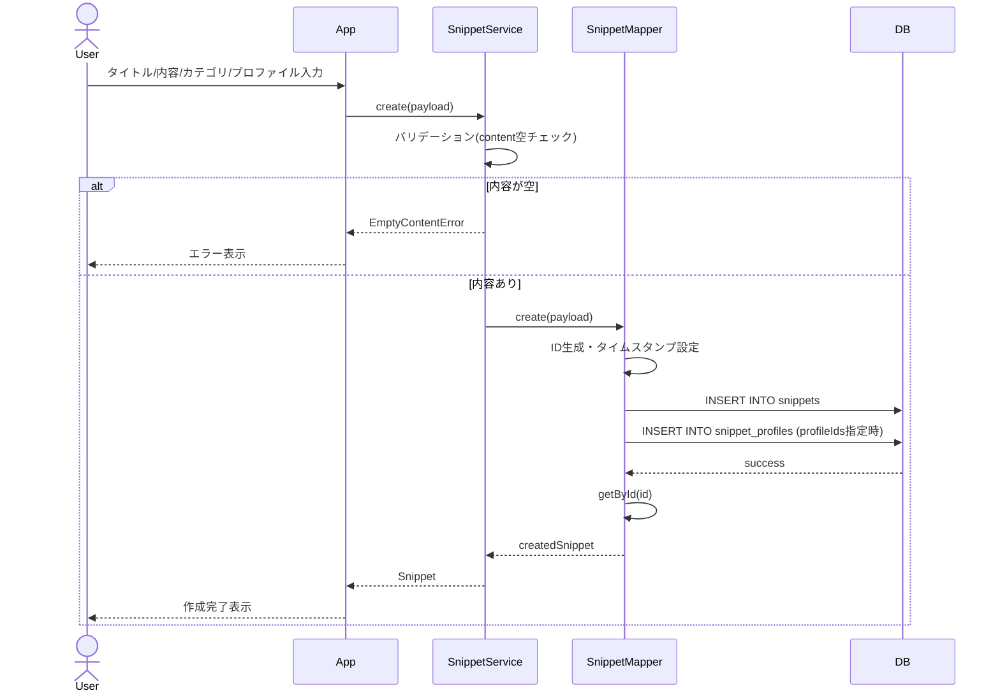
```mermaid
sequenceDiagram
  actor User
  participant App
  participant Svc as SnippetService
  participant Map as SnippetMapper
  participant DB
  User->>App: タイトル/内容/カテゴリ/プロファイル入力
  App->>Svc: create(payload)
  Svc->>Svc: バリデーション(content空チェック)
  alt 内容が空
    Svc-->>App: EmptyContentError
    App-->>User: エラー表示
  else 内容あり
    Svc->>Map: create(payload)
    Map->>Map: ID生成・タイムスタンプ設定
    Map->>DB: INSERT INTO snippets
    Map->>DB: INSERT INTO snippet_profiles (profileIds指定時)
    DB-->>Map: success
    Map->>Map: getById(id)
    Map-->>Svc: createdSnippet
    Svc-->>App: Snippet
    App-->>User: 作成完了表示
  end
```

### UC-SNP-002 定型文を編集する
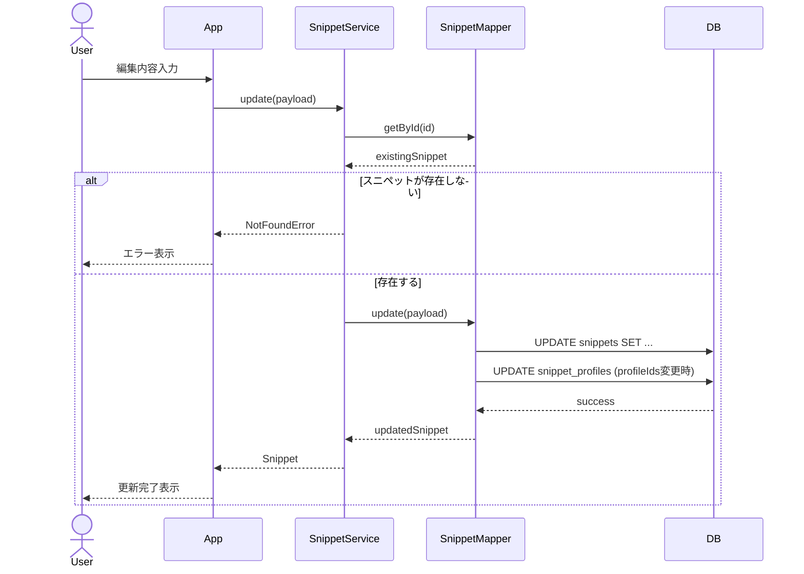
```mermaid
sequenceDiagram
  actor User
  participant App
  participant Svc as SnippetService
  participant Map as SnippetMapper
  participant DB
  User->>App: 編集内容入力
  App->>Svc: update(payload)
  Svc->>Map: getById(id)
  Map-->>Svc: existingSnippet
  alt スニペットが存在しない
    Svc-->>App: NotFoundError
    App-->>User: エラー表示
  else 存在する
    Svc->>Map: update(payload)
    Map->>DB: UPDATE snippets SET ...
    Map->>DB: UPDATE snippet_profiles (profileIds変更時)
    DB-->>Map: success
    Map-->>Svc: updatedSnippet
    Svc-->>App: Snippet
    App-->>User: 更新完了表示
  end
```

### UC-SNP-003 定型文を削除する
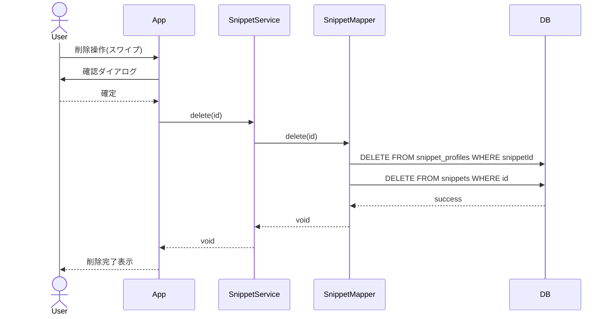
```mermaid
sequenceDiagram
  actor User
  participant App
  participant Svc as SnippetService
  participant Map as SnippetMapper
  participant DB
  User->>App: 削除操作(スワイプ)
  App->>User: 確認ダイアログ
  User-->>App: 確定
  App->>Svc: delete(id)
  Svc->>Map: delete(id)
  Map->>DB: DELETE FROM snippet_profiles WHERE snippetId
  Map->>DB: DELETE FROM snippets WHERE id
  DB-->>Map: success
  Map-->>Svc: void
  Svc-->>App: void
  App-->>User: 削除完了表示
```

### UC-SNP-004 定型文をコピーする
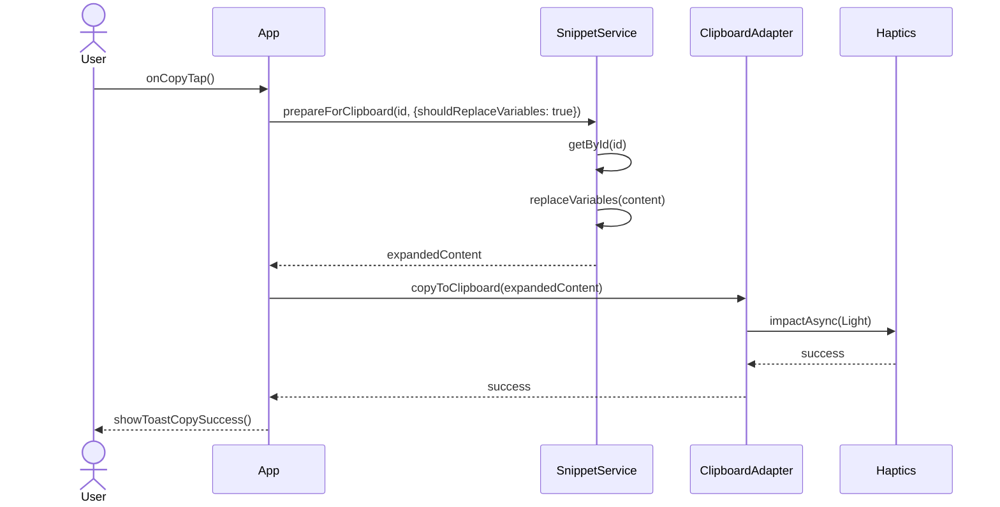
```mermaid
sequenceDiagram
  actor User
  participant App
  participant Svc as SnippetService
  participant Clip as ClipboardAdapter
  participant Haptics
  User->>App: onCopyTap()
  App->>Svc: prepareForClipboard(id, {shouldReplaceVariables: true})
  Svc->>Svc: getById(id)
  Svc->>Svc: replaceVariables(content)
  Svc-->>App: expandedContent
  App->>Clip: copyToClipboard(expandedContent)
  Clip->>Haptics: impactAsync(Light)
  Haptics-->>Clip: success
  Clip-->>App: success
  App-->>User: showToastCopySuccess()
```

### UC-SNP-005 タイトル付きでコピーする
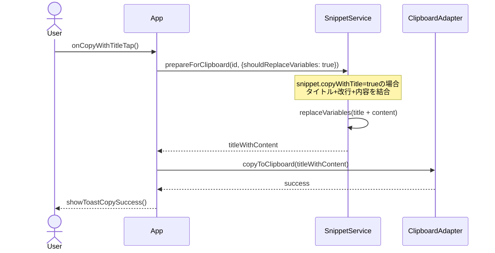
```mermaid
sequenceDiagram
  actor User
  participant App
  participant Svc as SnippetService
  participant Clip as ClipboardAdapter
  User->>App: onCopyWithTitleTap()
  App->>Svc: prepareForClipboard(id, {shouldReplaceVariables: true})
  Note over Svc: snippet.copyWithTitle=trueの場合<br/>タイトル+改行+内容を結合
  Svc->>Svc: replaceVariables(title + content)
  Svc-->>App: titleWithContent
  App->>Clip: copyToClipboard(titleWithContent)
  Clip-->>App: success
  App-->>User: showToastCopySuccess()
```

### UC-SNP-006 定型文一覧を閲覧する
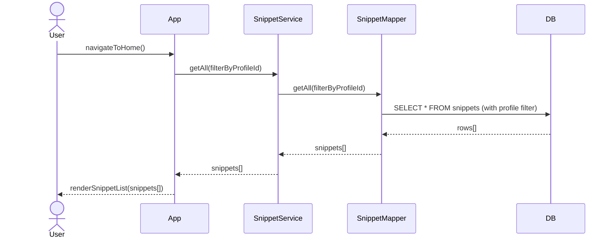
```mermaid
sequenceDiagram
  actor User
  participant App
  participant Svc as SnippetService
  participant Map as SnippetMapper
  participant DB
  User->>App: navigateToHome()
  App->>Svc: getAll(filterByProfileId)
  Svc->>Map: getAll(filterByProfileId)
  Map->>DB: SELECT * FROM snippets (with profile filter)
  DB-->>Map: rows[]
  Map-->>Svc: snippets[]
  Svc-->>App: snippets[]
  App-->>User: renderSnippetList(snippets[])
```

### UC-SNP-007 定型文一覧を更新する
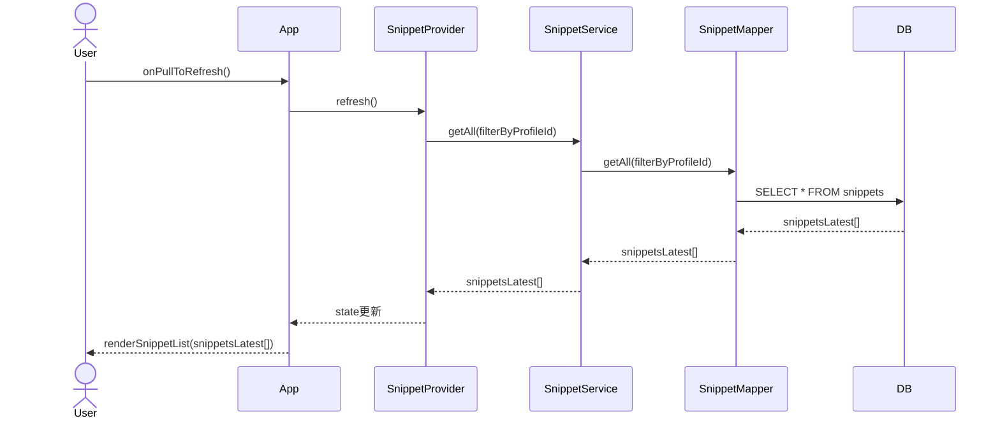
```mermaid
sequenceDiagram
  actor User
  participant App
  participant Provider as SnippetProvider
  participant Svc as SnippetService
  participant Map as SnippetMapper
  participant DB
  User->>App: onPullToRefresh()
  App->>Provider: refresh()
  Provider->>Svc: getAll(filterByProfileId)
  Svc->>Map: getAll(filterByProfileId)
  Map->>DB: SELECT * FROM snippets
  DB-->>Map: snippetsLatest[]
  Map-->>Svc: snippetsLatest[]
  Svc-->>Provider: snippetsLatest[]
  Provider-->>App: state更新
  App-->>User: renderSnippetList(snippetsLatest[])
```

### UC-SNP-008 変数を挿入する
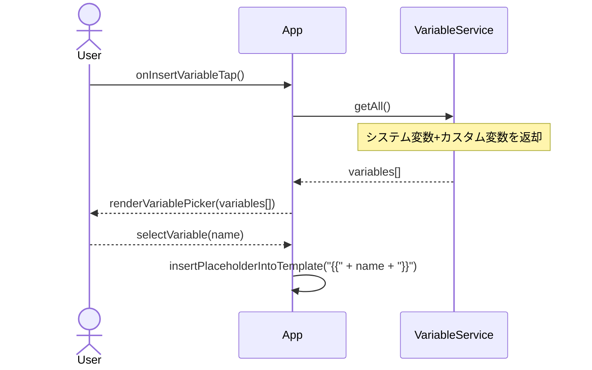
```mermaid
sequenceDiagram
  actor User
  participant App
  participant VarSvc as VariableService
  User->>App: onInsertVariableTap()
  App->>VarSvc: getAll()
  Note over VarSvc: システム変数+カスタム変数を返却
  VarSvc-->>App: variables[]
  App-->>User: renderVariablePicker(variables[])
  User-->>App: selectVariable(name)
  App->>App: insertPlaceholderIntoTemplate("{{" + name + "}}")
```

### UC-SNP-009 プレビューを確認する
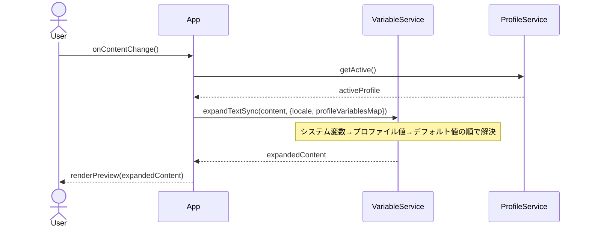
```mermaid
sequenceDiagram
  actor User
  participant App
  participant VarSvc as VariableService
  participant ProfSvc as ProfileService
  User->>App: onContentChange()
  App->>ProfSvc: getActive()
  ProfSvc-->>App: activeProfile
  App->>VarSvc: expandTextSync(content, {locale, profileVariablesMap})
  Note over VarSvc: システム変数→プロファイル値→デフォルト値の順で解決
  VarSvc-->>App: expandedContent
  App-->>User: renderPreview(expandedContent)
```

### UC-SNP-010 プロファイルを割り当てる
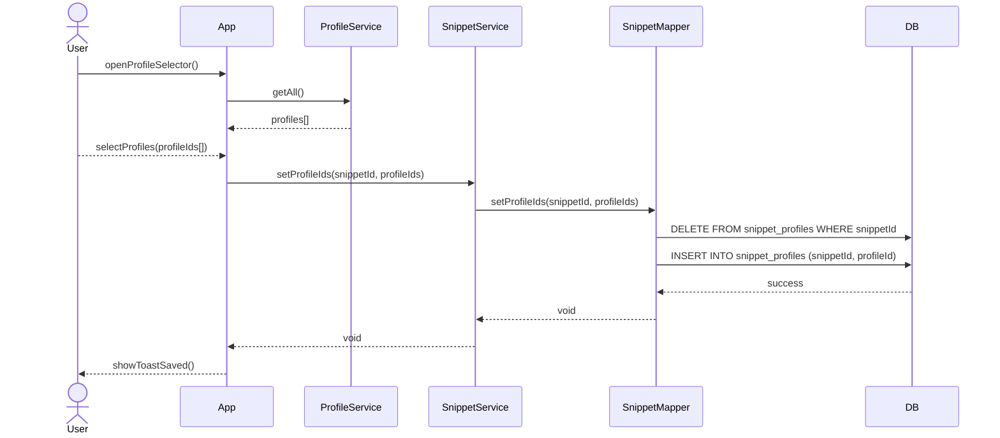
```mermaid
sequenceDiagram
  actor User
  participant App
  participant ProfSvc as ProfileService
  participant Svc as SnippetService
  participant Map as SnippetMapper
  participant DB
  User->>App: openProfileSelector()
  App->>ProfSvc: getAll()
  ProfSvc-->>App: profiles[]
  User-->>App: selectProfiles(profileIds[])
  App->>Svc: setProfileIds(snippetId, profileIds)
  Svc->>Map: setProfileIds(snippetId, profileIds)
  Map->>DB: DELETE FROM snippet_profiles WHERE snippetId
  Map->>DB: INSERT INTO snippet_profiles (snippetId, profileId)
  DB-->>Map: success
  Map-->>Svc: void
  Svc-->>App: void
  App-->>User: showToastSaved()
```

### UC-SNP-011 カテゴリを割り当てる
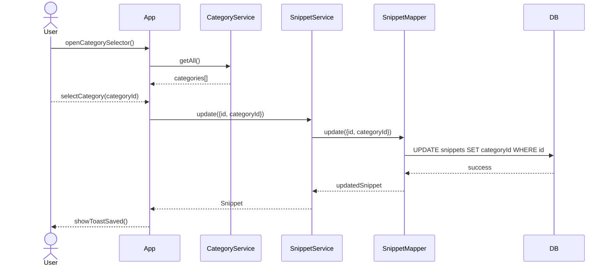
```mermaid
sequenceDiagram
  actor User
  participant App
  participant CatSvc as CategoryService
  participant Svc as SnippetService
  participant Map as SnippetMapper
  participant DB
  User->>App: openCategorySelector()
  App->>CatSvc: getAll()
  CatSvc-->>App: categories[]
  User-->>App: selectCategory(categoryId)
  App->>Svc: update({id, categoryId})
  Svc->>Map: update({id, categoryId})
  Map->>DB: UPDATE snippets SET categoryId WHERE id
  DB-->>Map: success
  Map-->>Svc: updatedSnippet
  Svc-->>App: Snippet
  App-->>User: showToastSaved()
```

---

## 2. カテゴリ（Category）管理

### UC-CAT-001 カテゴリを新規作成する
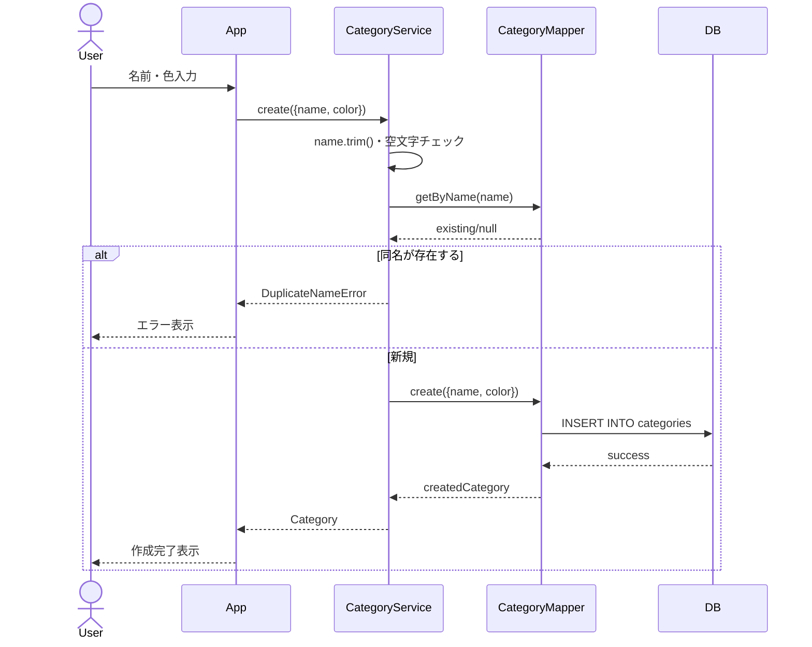
```mermaid
sequenceDiagram
  actor User
  participant App
  participant CatSvc as CategoryService
  participant Map as CategoryMapper
  participant DB
  User->>App: 名前・色入力
  App->>CatSvc: create({name, color})
  CatSvc->>CatSvc: name.trim()・空文字チェック
  CatSvc->>Map: getByName(name)
  Map-->>CatSvc: existing/null
  alt 同名が存在する
    CatSvc-->>App: DuplicateNameError
    App-->>User: エラー表示
  else 新規
    CatSvc->>Map: create({name, color})
    Map->>DB: INSERT INTO categories
    DB-->>Map: success
    Map-->>CatSvc: createdCategory
    CatSvc-->>App: Category
    App-->>User: 作成完了表示
  end
```

### UC-CAT-002 カテゴリを編集する
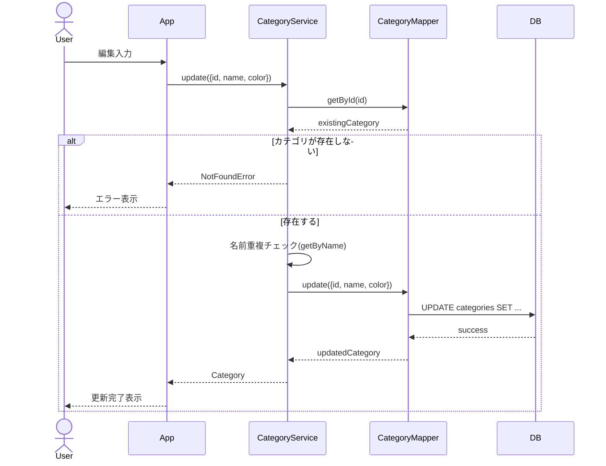
```mermaid
sequenceDiagram
  actor User
  participant App
  participant CatSvc as CategoryService
  participant Map as CategoryMapper
  participant DB
  User->>App: 編集入力
  App->>CatSvc: update({id, name, color})
  CatSvc->>Map: getById(id)
  Map-->>CatSvc: existingCategory
  alt カテゴリが存在しない
    CatSvc-->>App: NotFoundError
    App-->>User: エラー表示
  else 存在する
    CatSvc->>CatSvc: 名前重複チェック(getByName)
    CatSvc->>Map: update({id, name, color})
    Map->>DB: UPDATE categories SET ...
    DB-->>Map: success
    Map-->>CatSvc: updatedCategory
    CatSvc-->>App: Category
    App-->>User: 更新完了表示
  end
```

### UC-CAT-003 カテゴリを削除する
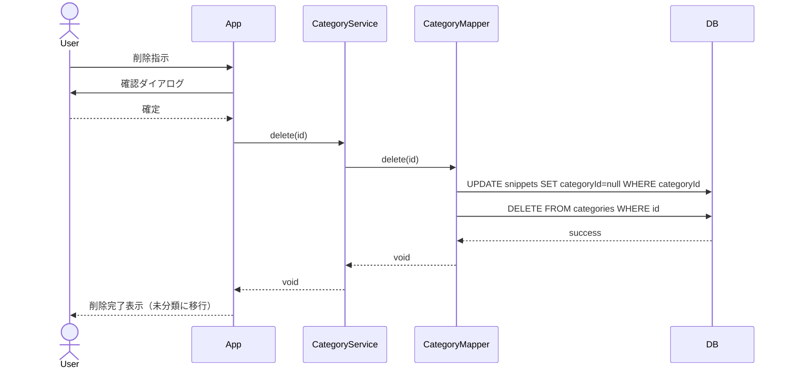
```mermaid
sequenceDiagram
  actor User
  participant App
  participant CatSvc as CategoryService
  participant Map as CategoryMapper
  participant DB
  User->>App: 削除指示
  App->>User: 確認ダイアログ
  User-->>App: 確定
  App->>CatSvc: delete(id)
  CatSvc->>Map: delete(id)
  Map->>DB: UPDATE snippets SET categoryId=null WHERE categoryId
  Map->>DB: DELETE FROM categories WHERE id
  DB-->>Map: success
  Map-->>CatSvc: void
  CatSvc-->>App: void
  App-->>User: 削除完了表示（未分類に移行）
```

### UC-CAT-004 カテゴリ一覧を閲覧する
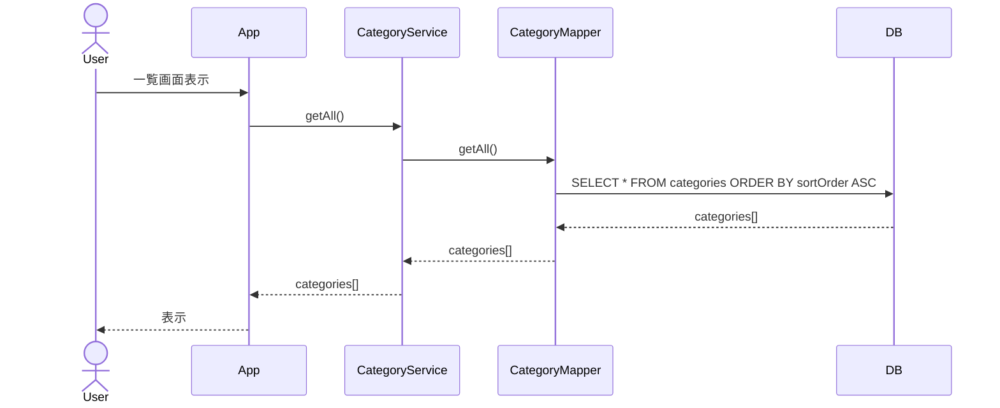
```mermaid
sequenceDiagram
  actor User
  participant App
  participant CatSvc as CategoryService
  participant Map as CategoryMapper
  participant DB
  User->>App: 一覧画面表示
  App->>CatSvc: getAll()
  CatSvc->>Map: getAll()
  Map->>DB: SELECT * FROM categories ORDER BY sortOrder ASC
  DB-->>Map: categories[]
  Map-->>CatSvc: categories[]
  CatSvc-->>App: categories[]
  App-->>User: 表示
```

### UC-CAT-005 カテゴリでフィルターする
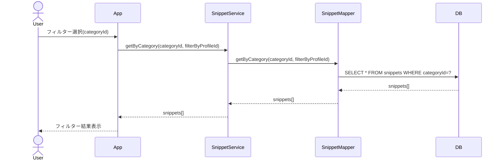
```mermaid
sequenceDiagram
  actor User
  participant App
  participant Svc as SnippetService
  participant Map as SnippetMapper
  participant DB
  User->>App: フィルター選択(categoryId)
  App->>Svc: getByCategory(categoryId, filterByProfileId)
  Svc->>Map: getByCategory(categoryId, filterByProfileId)
  Map->>DB: SELECT * FROM snippets WHERE categoryId=?
  DB-->>Map: snippets[]
  Map-->>Svc: snippets[]
  Svc-->>App: snippets[]
  App-->>User: フィルター結果表示
```

### UC-CAT-006 全カテゴリ表示に戻す
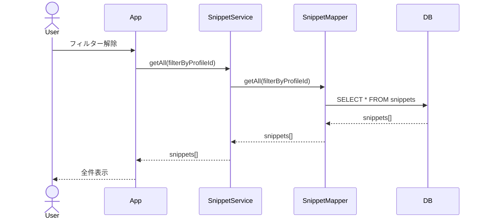
```mermaid
sequenceDiagram
  actor User
  participant App
  participant Svc as SnippetService
  participant Map as SnippetMapper
  participant DB
  User->>App: フィルター解除
  App->>Svc: getAll(filterByProfileId)
  Svc->>Map: getAll(filterByProfileId)
  Map->>DB: SELECT * FROM snippets
  DB-->>Map: snippets[]
  Map-->>Svc: snippets[]
  Svc-->>App: snippets[]
  App-->>User: 全件表示
```

### UC-CAT-007 未分類でフィルターする
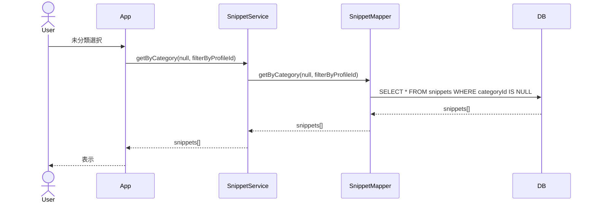
```mermaid
sequenceDiagram
  actor User
  participant App
  participant Svc as SnippetService
  participant Map as SnippetMapper
  participant DB
  User->>App: 未分類選択
  App->>Svc: getByCategory(null, filterByProfileId)
  Svc->>Map: getByCategory(null, filterByProfileId)
  Map->>DB: SELECT * FROM snippets WHERE categoryId IS NULL
  DB-->>Map: snippets[]
  Map-->>Svc: snippets[]
  Svc-->>App: snippets[]
  App-->>User: 表示
```

### UC-CAT-008 カテゴリを並び替える
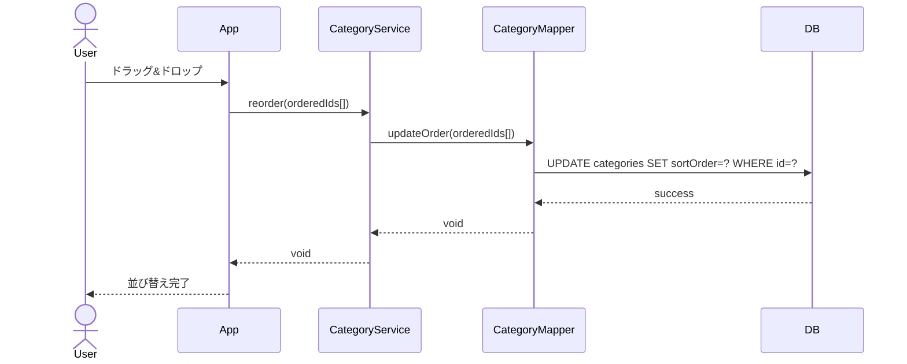
```mermaid
sequenceDiagram
  actor User
  participant App
  participant CatSvc as CategoryService
  participant Map as CategoryMapper
  participant DB
  User->>App: ドラッグ&ドロップ
  App->>CatSvc: reorder(orderedIds[])
  CatSvc->>Map: updateOrder(orderedIds[])
  Map->>DB: UPDATE categories SET sortOrder=? WHERE id=?
  DB-->>Map: success
  Map-->>CatSvc: void
  CatSvc-->>App: void
  App-->>User: 並び替え完了
```

---

## 3. プロファイル（Profile/環境）管理

### UC-PRF-001 プロファイルを新規作成する
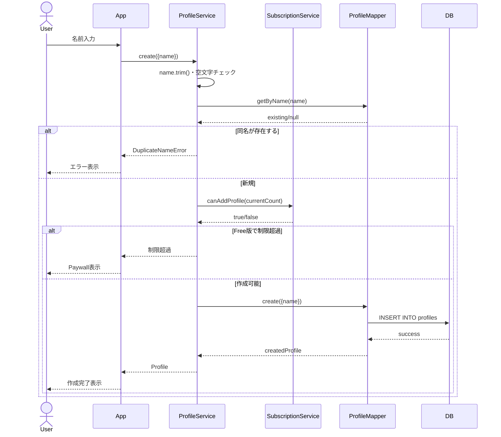
```mermaid
sequenceDiagram
  actor User
  participant App
  participant ProfSvc as ProfileService
  participant SubSvc as SubscriptionService
  participant Map as ProfileMapper
  participant DB
  User->>App: 名前入力
  App->>ProfSvc: create({name})
  ProfSvc->>ProfSvc: name.trim()・空文字チェック
  ProfSvc->>Map: getByName(name)
  Map-->>ProfSvc: existing/null
  alt 同名が存在する
    ProfSvc-->>App: DuplicateNameError
    App-->>User: エラー表示
  else 新規
    ProfSvc->>SubSvc: canAddProfile(currentCount)
    SubSvc-->>ProfSvc: true/false
    alt Free版で制限超過
      ProfSvc-->>App: 制限超過
      App-->>User: Paywall表示
    else 作成可能
      ProfSvc->>Map: create({name})
      Map->>DB: INSERT INTO profiles
      DB-->>Map: success
      Map-->>ProfSvc: createdProfile
      ProfSvc-->>App: Profile
      App-->>User: 作成完了表示
    end
  end
```

### UC-PRF-002 プロファイルを編集する
```mermaid
sequenceDiagram
  actor User
  participant App
  participant ProfSvc as ProfileService
  participant Map as ProfileMapper
  participant DB
  User->>App: 名前修正
  App->>ProfSvc: update(id, {name})
  ProfSvc->>Map: getById(id)
  Map-->>ProfSvc: existingProfile
  alt プロファイルが存在しない
    ProfSvc-->>App: NotFoundError
    App-->>User: エラー表示
  else 存在する
    ProfSvc->>ProfSvc: 名前重複チェック(getByName)
    ProfSvc->>Map: update({id, name})
    Map->>DB: UPDATE profiles SET name=? WHERE id=?
    DB-->>Map: success
    Map-->>ProfSvc: updatedProfile
    ProfSvc-->>App: Profile
    App-->>User: 更新完了表示
  end
```

### UC-PRF-003 プロファイルを削除する
```mermaid
sequenceDiagram
  actor User
  participant App
  participant ProfSvc as ProfileService
  participant Map as ProfileMapper
  participant DB
  User->>App: 削除操作
  App->>User: 確認ダイアログ
  User-->>App: 確定
  App->>ProfSvc: deleteWithAutoSwitch(id)
  ProfSvc->>Map: getById(id)
  Map-->>ProfSvc: profile
  alt デフォルトプロファイル
    ProfSvc-->>App: 削除不可エラー
    App-->>User: エラー表示
  else 削除可能
    ProfSvc->>Map: delete(id)
    Map->>DB: DELETE FROM profile_variables WHERE profileId
    Map->>DB: DELETE FROM snippet_profiles WHERE profileId
    Map->>DB: DELETE FROM profiles WHERE id
    DB-->>Map: success
    ProfSvc->>ProfSvc: アクティブなら自動切替
    ProfSvc-->>App: 完了
    App-->>User: 削除完了表示
  end
```

### UC-PRF-004 プロファイル一覧を閲覧する
```mermaid
sequenceDiagram
  actor User
  participant App
  participant ProfSvc as ProfileService
  participant Map as ProfileMapper
  participant DB
  User->>App: 一覧表示
  App->>ProfSvc: getAllIncludingInvalid()
  ProfSvc->>Map: getAllIncludingInvalid()
  Map->>DB: SELECT * FROM profiles ORDER BY sortOrder ASC
  DB-->>Map: profiles[]
  Map-->>ProfSvc: profiles[]
  ProfSvc-->>App: profiles[]
  App-->>User: 表示（無効は淡く表示）
```

### UC-PRF-005 プロファイルを切り替える
```mermaid
sequenceDiagram
  actor User
  participant App
  participant ProfSvc as ProfileService
  participant Evt as dataUpdateEmitter
  participant Map as ProfileMapper
  participant DB
  User->>App: セレクターで選択
  App->>ProfSvc: setActive(profileId)
  ProfSvc->>Map: setActive(profileId)
  Map->>DB: UPDATE profiles SET isActive=0
  Map->>DB: UPDATE profiles SET isActive=1 WHERE id=profileId
  DB-->>Map: success
  Map-->>ProfSvc: void
  ProfSvc->>Evt: emit('profileVariablesUpdated')
  Evt-->>App: リスナー起動
  App-->>User: 変数/スニペット表示を再計算
```

### UC-PRF-006 プロファイル別変数値を設定する
```mermaid
sequenceDiagram
  actor User
  participant App
  participant ProfSvc as ProfileService
  participant Evt as dataUpdateEmitter
  participant Map as ProfileVariableMapper
  participant DB
  User->>App: 値入力
  App->>ProfSvc: setProfileVariable(profileId, variableId, value)
  ProfSvc->>Map: upsert({profileId, variableId, value})
  Map->>DB: INSERT OR REPLACE INTO profile_variables
  DB-->>Map: success
  Map-->>ProfSvc: ProfileVariable
  ProfSvc->>Evt: emit('profileVariablesUpdated')
  ProfSvc-->>App: ProfileVariable
  Evt-->>App: リスナー起動(表示更新)
  App-->>User: 保存完了表示
```

### UC-PRF-007 無効化されたプロファイルを表示する
```mermaid
sequenceDiagram
  participant App
  participant ProfSvc as ProfileService
  participant SubSvc as SubscriptionService
  App->>ProfSvc: getAllIncludingInvalid()
  ProfSvc-->>App: profiles[] (with valid flag)
  App->>SubSvc: isSubscribed()
  SubSvc-->>App: false
  Note over App: valid=falseのプロファイルを淡く表示<br/>タップ時にPaywallへ誘導
  App-->>User: 一覧表示（無効は淡く表示）
```

### UC-PRF-008 アクティブプロファイルを自動切替する
```mermaid
sequenceDiagram
  participant ProfSvc as ProfileService
  participant Map as ProfileMapper
  participant DB
  ProfSvc->>ProfSvc: deleteWithAutoSwitch(id)
  ProfSvc->>Map: getActive()
  Map-->>ProfSvc: deletedProfile (was active)
  ProfSvc->>Map: getDefault()
  Map-->>ProfSvc: defaultProfile
  ProfSvc->>Map: setActive(defaultProfile.id)
  Map->>DB: UPDATE profiles SET isActive=1 WHERE id=defaultId
  DB-->>Map: success
```

### UC-PRF-009 プロファイルをデフォルト設定する
```mermaid
sequenceDiagram
  actor User
  participant App
  participant ProfSvc as ProfileService
  participant Map as ProfileMapper
  participant DB
  User->>App: デフォルト設定操作
  App->>ProfSvc: setDefault(profileId)
  ProfSvc->>Map: setDefault(profileId)
  Map->>DB: UPDATE profiles SET isDefault=0
  Map->>DB: UPDATE profiles SET isDefault=1 WHERE id=profileId
  DB-->>Map: success
  Map-->>ProfSvc: void
  ProfSvc-->>App: void
  App-->>User: 設定完了表示
```

### UC-PRF-010 プロファイル変数マップを取得する
```mermaid
sequenceDiagram
  participant App
  participant ProfSvc as ProfileService
  participant Map as ProfileVariableMapper
  participant DB
  App->>ProfSvc: getProfileVariablesMap(profileId)
  ProfSvc->>Map: getByProfileIdWithVariableNames(profileId)
  Map->>DB: SELECT pv.*, v.name FROM profile_variables pv JOIN variables v
  DB-->>Map: profileVariables[]
  Map-->>ProfSvc: profileVariables[]
  ProfSvc->>ProfSvc: buildMap(profileVariables)
  ProfSvc-->>App: Record<string, string>
```

---

## 4. 変数（Variable）管理

### UC-VAR-001 カスタム変数を新規作成する
```mermaid
sequenceDiagram
  actor User
  participant App
  participant VarSvc as VariableService
  participant SubSvc as SubscriptionService
  participant Map as VariableMapper
  participant DB
  User->>App: 名前/ラベル/アイコン入力
  App->>VarSvc: create({name, label, icon})
  VarSvc->>VarSvc: バリデーション(名前形式・予約語チェック)
  VarSvc->>Map: getByName(name)
  Map-->>VarSvc: existing/null
  alt 同名が存在する
    VarSvc-->>App: DuplicateNameError
    App-->>User: エラー表示
  else 新規
    VarSvc->>SubSvc: canAddVariable(currentCount)
    SubSvc-->>VarSvc: true/false
    alt Free版で制限超過
      VarSvc-->>App: 制限超過
      App-->>User: Paywall表示
    else 作成可能
      VarSvc->>Map: create({name, label, icon, type: 'custom'})
      Map->>DB: INSERT INTO variables
      DB-->>Map: success
      Map-->>VarSvc: createdVariable
      VarSvc-->>App: Variable
      App-->>User: 作成完了表示
    end
  end
```

### UC-VAR-002 カスタム変数を編集する
```mermaid
sequenceDiagram
  actor User
  participant App
  participant VarSvc as VariableService
  participant Map as VariableMapper
  participant DB
  User->>App: 編集入力
  App->>VarSvc: update(id, payload)
  VarSvc->>VarSvc: バリデーション
  VarSvc->>Map: update(id, payload)
  Map->>DB: UPDATE variables SET ... WHERE id
  DB-->>Map: success
  Map-->>VarSvc: updatedVariable
  VarSvc-->>App: Variable
  App-->>User: 更新完了表示
```

### UC-VAR-003 カスタム変数を削除する
```mermaid
sequenceDiagram
  actor User
  participant App
  participant VarSvc as VariableService
  participant Map as VariableMapper
  participant DB
  User->>App: 削除操作
  App->>User: 確認ダイアログ
  User-->>App: 確定
  App->>VarSvc: delete(id)
  VarSvc->>Map: delete(id)
  Map->>DB: DELETE FROM profile_variables WHERE variableId
  Map->>DB: DELETE FROM variables WHERE id
  DB-->>Map: success
  Map-->>VarSvc: void
  VarSvc-->>App: 完了
  App-->>User: 削除完了表示
```

### UC-VAR-004 変数一覧を閲覧する
```mermaid
sequenceDiagram
  actor User
  participant App
  participant VarSvc as VariableService
  participant Map as VariableMapper
  participant DB
  User->>App: 変数一覧表示
  App->>VarSvc: getAllIncludingInvalid()
  VarSvc->>Map: getAllIncludingInvalid()
  Map->>DB: SELECT * FROM variables ORDER BY sortOrder ASC
  DB-->>Map: variables[]
  Map-->>VarSvc: variables[]
  Note over VarSvc: システム変数+カスタム変数<br/>（無効化されたものも含む）
  VarSvc-->>App: variables[]
  App-->>User: 表示
```

### UC-VAR-005 プロファイル別値を設定する
```mermaid
sequenceDiagram
  actor User
  participant App
  participant VarSvc as VariableService
  participant Evt as dataUpdateEmitter
  participant Map as ProfileVariableMapper
  participant DB
  User->>App: プロファイルごとに値入力
  App->>VarSvc: upsertValueForProfile(profileId, variableId, value)
  VarSvc->>Map: upsert({profileId, variableId, value})
  Map->>DB: INSERT OR REPLACE INTO profile_variables
  DB-->>Map: success
  Map-->>VarSvc: ProfileVariable
  VarSvc->>Evt: emit('profileVariablesUpdated')
  VarSvc-->>App: ProfileVariable
  Evt-->>App: リスナー起動(表示更新)
  App-->>User: 保存完了表示
```

### UC-VAR-006 システム変数を使用する
```mermaid
sequenceDiagram
  actor User
  participant App
  participant VarSvc as VariableService
  participant LocaleAdp as LocaleAdapter
  User->>App: テンプレートに{{today}}等挿入
  App->>VarSvc: expandTextSync(content, {locale, profileVariablesMap})
  VarSvc->>VarSvc: replaceVariables(content)
  Note over VarSvc: システム変数を最優先で解決<br/>日本語エイリアス({{今日}}等)も対応<br/>大文字小文字は区別しない
  VarSvc->>LocaleAdp: getLanguage()
  LocaleAdp-->>VarSvc: locale
  VarSvc->>VarSvc: システム変数値生成(today, now, time, year, month, day, weekday)
  VarSvc-->>App: 展開済みコンテンツ
  App-->>User: プレビュー/コピーに反映
```

**システム変数一覧**:
| 変数名 | 日本語エイリアス | 出力形式 | 出力例 |
|--------|----------------|----------|--------|
| `{{today}}` | `{{今日}}` | yyyy/MM/dd | 2025/12/15 |
| `{{now}}` | `{{現在}}` | yyyy/MM/dd HH:mm:ss | 2025/12/15 14:30:45 |
| `{{time}}` | `{{時刻}}` | HH:mm | 14:30 |
| `{{year}}` | `{{年}}` | yyyy | 2025 |
| `{{month}}` | `{{月}}` | MM | 12 |
| `{{day}}` | `{{日}}` | dd | 15 |
| `{{weekday}}` | `{{曜日}}` | 曜日（短縮） | Mon (en) / 月 (ja) |

### UC-VAR-007 無効化された変数を表示する
```mermaid
sequenceDiagram
  participant App
  participant VarSvc as VariableService
  participant SubSvc as SubscriptionService
  App->>VarSvc: getAllIncludingInvalid()
  VarSvc-->>App: variables[] (with valid flag)
  App->>SubSvc: isSubscribed()
  SubSvc-->>App: false
  Note over App: valid=falseの変数を淡く表示<br/>タップ時にPaywallへ誘導
  App-->>User: 一覧表示（無効は淡く表示）
```

### UC-VAR-008 変数名のバリデーションを行う
```mermaid
sequenceDiagram
  actor User
  participant App
  participant VarSvc as VariableService
  User->>App: 変数名入力
  App->>VarSvc: validateVariableName(name)
  VarSvc->>VarSvc: 正規表現チェック(^[a-zA-Z_][a-zA-Z0-9_]*$)
  VarSvc->>VarSvc: 予約語チェック(today, now等)
  VarSvc->>VarSvc: 長さチェック(max 50)
  alt バリデーション失敗
    VarSvc-->>App: ValidationError
    App-->>User: エラーメッセージ表示
  else 成功
    VarSvc-->>App: true
    App-->>User: 入力受付
  end
```

### UC-VAR-009 変数リゾルバーを作成する
```mermaid
sequenceDiagram
  participant App
  participant VarSvc as VariableService
  participant ProfSvc as ProfileService
  App->>VarSvc: createCustomVariableResolver(context)
  VarSvc->>VarSvc: コンテキスト情報を保持
  Note over VarSvc: locale, profileVariablesMap, defaultValuesMap
  VarSvc-->>App: VariableResolver function
  App->>App: resolver(variableName)
  Note over App: システム変数→プロファイル値→デフォルト値の順で解決
```

### UC-VAR-010 プロファイル別変数値を一括設定する
```mermaid
sequenceDiagram
  actor User
  participant App
  participant VarSvc as VariableService
  participant Map as ProfileVariableMapper
  participant DB
  User->>App: 複数プロファイルの値を入力
  App->>VarSvc: upsertValuesForProfiles(variableId, profileValues)
  loop 各プロファイル
    VarSvc->>Map: upsert({profileId, variableId, value})
    Map->>DB: INSERT OR REPLACE INTO profile_variables
    DB-->>Map: success
  end
  VarSvc-->>App: void
  App-->>User: 保存完了表示
```

---

## 5. 検索

### UC-SRC-001 キーワードで検索する
```mermaid
sequenceDiagram
  actor User
  participant App
  participant Svc as SnippetService
  participant Map as SnippetMapper
  participant DB
  User->>App: キーワード入力
  App->>App: debounce 300ms
  App->>Svc: search(query, categoryId)
  Svc->>Map: search(query, categoryId)
  Map->>DB: SELECT * FROM snippets WHERE (title LIKE ? OR content LIKE ?)
  DB-->>Map: snippets[]
  Map-->>Svc: snippets[]
  Svc-->>App: snippets[]
  App-->>User: 結果表示
```

### UC-SRC-002 検索結果をコピーする
```mermaid
sequenceDiagram
  actor User
  participant App
  participant Svc as SnippetService
  participant Clip as ClipboardAdapter
  User->>App: 検索結果からコピー
  App->>Svc: prepareForClipboard(id, {shouldReplaceVariables: true})
  Svc->>Svc: replaceVariables(content)
  Svc-->>App: expandedContent
  App->>Clip: copyToClipboard(expandedContent)
  Clip-->>App: success
  App-->>User: コピー完了表示
```

### UC-SRC-003 検索結果から編集する
```mermaid
sequenceDiagram
  actor User
  participant App
  User->>App: 検索結果行をタップ
  App-->>User: /snippet/edit画面に遷移
```

### UC-SRC-004 検索をクリアする
```mermaid
sequenceDiagram
  actor User
  participant App
  User->>App: クリア操作
  App->>App: setQuery('')
  App-->>User: 空状態表示
```

### UC-SRC-005 検索画面を閉じる
```mermaid
sequenceDiagram
  actor User
  participant App
  User->>App: 閉じる
  App-->>User: ホームへ戻る
```

### UC-SRC-006 プロファイルでフィルターする
```mermaid
sequenceDiagram
  actor User
  participant App
  participant Svc as SnippetService
  participant Map as SnippetMapper
  participant DB
  User->>App: プロファイル絞り込み
  App->>Svc: getAll(filterByProfileId)
  Svc->>Map: getAll(filterByProfileId)
  Note over Map: snippet_profilesテーブルでフィルタリング
  Map->>DB: SELECT DISTINCT s.* FROM snippets s LEFT JOIN snippet_profiles sp ...
  DB-->>Map: snippets[]
  Map-->>Svc: snippets[]
  Svc-->>App: snippets[]
  App-->>User: 表示
```

---

## 6. エクスポート・インポート

### UC-EXP-001 全データをエクスポートする
```mermaid
sequenceDiagram
  actor User
  participant App
  participant ExpSvc as ExportService
  participant ExpAdp as ExportAdapter
  participant FileIO as FileIOAdapter
  participant Crypto as CryptoAdapter
  participant DB
  User->>App: エクスポート実行
  App->>ExpSvc: exportDatabase(password)
  ExpSvc->>ExpAdp: getDatabasePath()
  ExpAdp-->>ExpSvc: dbPath
  ExpSvc->>FileIO: readBinary(dbPath)
  FileIO-->>ExpSvc: dbFileBase64
  ExpSvc->>Crypto: sha256(password + version)
  Crypto-->>ExpSvc: passwordHash
  ExpSvc->>ExpSvc: createExportData(dbFileBase64, passwordHash)
  Note over ExpSvc: 二重Base64エンコード・チェックサム生成
  ExpSvc->>ExpAdp: saveExportFile(filename, json)
  ExpAdp-->>ExpSvc: exportFileUri
  ExpSvc-->>App: {filePath: exportFileUri}
  App-->>User: 保存ダイアログ/成功表示
```

### UC-EXP-002 選択データをエクスポートする
```mermaid
sequenceDiagram
  actor User
  participant App
  participant ExpSvc as ExportService
  participant ExpMap as ExportMapper
  participant DB
  User->>App: 対象選択
  App->>ExpSvc: exportSelectedData(password, selection)
  ExpSvc->>ExpMap: deleteUnselectedData(selection)
  ExpMap->>DB: 選択されていないデータを削除
  DB-->>ExpMap: success
  ExpSvc->>ExpSvc: createExportData(...)
  ExpSvc-->>App: {filePath: exportFileUri}
  App-->>User: 保存
```

### UC-IMP-001 ファイルを選択する
```mermaid
sequenceDiagram
  actor User
  participant App
  participant FilePicker as FilePickerAdapter
  User->>App: インポートボタン
  App->>FilePicker: pickFile({type: '.cliptap'})
  FilePicker-->>App: fileUri
  App-->>User: パスワード入力画面
```

### UC-IMP-002 フルリストアを実行する
```mermaid
sequenceDiagram
  actor User
  participant App
  participant ImportSvc as ImportService
  participant SubSvc as SubscriptionService
  participant ProfSvc as ProfileService
  participant Evt as dataUpdateEmitter
  User->>App: フルリストア開始
  App->>ImportSvc: importDatabaseFromTempDb(tempDbPath)
  ImportSvc->>ImportSvc: deleteAllExistingData()
  Note over ImportSvc: 外部キー制約を考慮した順序で削除
  ImportSvc->>ImportSvc: executePartialImportWithMapper(all IDs)
  Note over ImportSvc: カテゴリ→変数→プロファイル→スニペット
  ImportSvc->>ProfSvc: ensureDefaultAndActiveProfile()
  ImportSvc->>SubSvc: updateValidFlags()
  ImportSvc->>Evt: emit('dataImported')
  Evt-->>App: リスナー起動(全Provider再読み込み)
  ImportSvc-->>App: success
  App-->>User: 完了表示
```

### UC-IMP-003 インポート候補を確認する
```mermaid
sequenceDiagram
  actor User
  participant App
  participant ImportSvc as ImportService
  participant Mapper as ImportMapper
  User->>App: 候補確認要求
  App->>ImportSvc: getImportCandidates(tempDbPath)
  ImportSvc->>Mapper: getAllCandidates()
  Mapper-->>ImportSvc: candidates
  ImportSvc-->>App: {categories, variables, profiles, snippets}
  App-->>User: 候補一覧表示
```

### UC-IMP-004 部分インポートを実行する
```mermaid
sequenceDiagram
  actor User
  participant App
  participant ImportSvc as ImportService
  participant SubSvc as SubscriptionService
  participant ProfSvc as ProfileService
  participant Evt as dataUpdateEmitter
  User->>App: 対象を選択
  App->>ImportSvc: importPartial(tempDbPath, selectedIds)
  ImportSvc->>ImportSvc: executePartialImportWithMapper(selectedIds)
  Note over ImportSvc: IDマッピング解決・重複チェック
  ImportSvc->>ProfSvc: ensureDefaultAndActiveProfile()
  ImportSvc->>SubSvc: updateValidFlags()
  ImportSvc->>Evt: emit('dataImported')
  Evt-->>App: リスナー起動
  ImportSvc-->>App: success
  App-->>User: 成功表示
```

### UC-IMP-005 デフォルト/アクティブプロファイルを補正する
```mermaid
sequenceDiagram
  participant ImportSvc as ImportService
  participant ProfSvc as ProfileService
  ImportSvc->>ProfSvc: ensureDefaultAndActiveProfile()
  ProfSvc->>ProfSvc: getDefault()
  alt デフォルトがない
    ProfSvc->>ProfSvc: setDefault(firstProfile.id)
  end
  ProfSvc->>ProfSvc: getActive()
  alt アクティブがない
    ProfSvc->>ProfSvc: setActive(defaultProfile.id)
  end
```

### UC-IMP-006 インポート完了を通知する
```mermaid
sequenceDiagram
  participant ImportSvc as ImportService
  participant Evt as dataUpdateEmitter
  participant SnippetProvider
  participant ProfileProvider
  participant VariableProvider
  participant CategoryProvider
  ImportSvc->>Evt: emit('dataImported')
  Evt-->>SnippetProvider: リスナー起動
  SnippetProvider->>SnippetProvider: loadSnippets()
  Evt-->>ProfileProvider: リスナー起動
  ProfileProvider->>ProfileProvider: loadProfiles()
  Evt-->>VariableProvider: リスナー起動
  VariableProvider->>VariableProvider: loadVariables()
  Evt-->>CategoryProvider: リスナー起動
  CategoryProvider->>CategoryProvider: loadCategories()
```

### UC-IMP-007 インポート時にsortOrderを復元する
```mermaid
sequenceDiagram
  participant ImportSvc as ImportService
  participant Mapper as ImportMapper
  participant DB
  ImportSvc->>Mapper: getCategories(categoryIds)
  Mapper->>DB: SELECT * (including sortOrder)
  DB-->>Mapper: categories with sortOrder
  ImportSvc->>ImportSvc: create categories preserving sortOrder
  Note over ImportSvc: プロファイル・変数も同様に処理
```

### UC-IMP-008 インポート時にIDマッピングを解決する
```mermaid
sequenceDiagram
  participant ImportSvc as ImportService
  participant CatSvc as CategoryService
  participant MainDB as DB
  ImportSvc->>ImportSvc: categoryIdMap = {}
  loop 各カテゴリ
    ImportSvc->>CatSvc: getByName(category.name)
    alt 既存あり
      CatSvc-->>ImportSvc: existingCategory
      ImportSvc->>ImportSvc: categoryIdMap[oldId] = existingCategory.id
    else 新規
      ImportSvc->>CatSvc: create(category)
      CatSvc-->>ImportSvc: newCategory
      ImportSvc->>ImportSvc: categoryIdMap[oldId] = newCategory.id
    end
  end
  Note over ImportSvc: スニペット作成時にcategoryIdMapで変換
```

### UC-IMP-009 インポートファイルを検証する
```mermaid
sequenceDiagram
  participant ImportSvc as ImportService
  participant Parser as ImportParserService
  participant Crypto as CryptoAdapter
  ImportSvc->>Parser: parseAndValidate(jsonContent, password)
  Parser->>Parser: JSONパース
  Parser->>Parser: スキーマバージョンチェック
  Parser->>Crypto: sha256(password + version)
  Crypto-->>Parser: expectedHash
  Parser->>Parser: パスワードハッシュ検証
  Parser->>Parser: チェックサム検証
  Parser->>Parser: 二重Base64デコード
  alt 検証失敗
    Parser-->>ImportSvc: ValidationError
  else 成功
    Parser-->>ImportSvc: ValidationResult (dbBase64)
  end
```

### UC-IMP-010 一時データベースをクリーンアップする
```mermaid
sequenceDiagram
  participant ImportSvc as ImportService
  participant FileIO as FileIOAdapter
  ImportSvc->>FileIO: cleanupTempDatabase(tempDbPath)
  FileIO->>FileIO: deleteFile(tempDbPath)
  FileIO-->>ImportSvc: success
```

---

## 7. サブスクリプション

### UC-SUB-001 Proプランを購入する
```mermaid
sequenceDiagram
  actor User
  participant App
  participant RC as RevenueCat SDK
  participant SubSvc as SubscriptionService
  User->>App: プラン選択(¥250/月 or ¥3,000/年)
  App->>SubSvc: purchase(planId)
  SubSvc->>RC: purchase(planId)
  RC-->>SubSvc: customerInfo
  SubSvc->>SubSvc: updateValidFlags()
  SubSvc-->>App: isSubscribed=true
  App-->>User: 成功表示/広告非表示
  alt ユーザーキャンセル
    RC-->>SubSvc: userCancelled
    SubSvc-->>App: キャンセル
    App-->>User: キャンセル表示
  end
```

### UC-SUB-002 購入を復元する
```mermaid
sequenceDiagram
  actor User
  participant App
  participant SubSvc as SubscriptionService
  participant RC as RevenueCat SDK
  User->>App: 復元ボタン
  App->>SubSvc: restore()
  SubSvc->>RC: restorePurchases()
  RC-->>SubSvc: customerInfo
  SubSvc->>SubSvc: updateValidFlags()
  SubSvc-->>App: SubscriptionStatus
  App-->>User: 復元結果表示
```

### UC-SUB-003 サブスクリプション状態を確認する
```mermaid
sequenceDiagram
  actor User
  participant App
  participant SubSvc as SubscriptionService
  User->>App: 状態確認画面表示
  App->>SubSvc: getStatus()
  SubSvc-->>App: {isSubscribed, expirationDate, planId}
  App-->>User: 状態表示
```

### UC-SUB-004 Paywallを表示する
```mermaid
sequenceDiagram
  participant App
  participant SubSvc as SubscriptionService
  App->>SubSvc: canAddProfile(currentCount)
  SubSvc-->>App: false
  App-->>User: Paywall表示
```

### UC-SUB-005 Webでサブスク状態を検証する
```mermaid
sequenceDiagram
  participant WebApp as Web UI
  participant WebSub as WebSubscriptionAdapter
  participant RC as Purchases-js
  participant SubSvc as SubscriptionService
  WebApp->>WebSub: checkSubscription(userId)
  WebSub->>RC: getCustomerInfo()
  RC-->>WebSub: entitlements.active
  WebSub-->>WebApp: isSubscribed
  WebApp->>SubSvc: updateValidFlags()
  SubSvc-->>WebApp: 制限反映
```

### UC-SUB-006 モバイルでログイン後に自動復元する
```mermaid
sequenceDiagram
  participant App
  participant Auth as FirebaseAuth
  participant SubSvc as SubscriptionService
  participant RC as RevenueCat SDK
  App->>Auth: signIn()
  Auth-->>App: userId
  App->>SubSvc: linkAccount(userId)
  SubSvc->>RC: logIn(userId)
  RC-->>SubSvc: customerInfo
  SubSvc->>RC: restorePurchases()
  RC-->>SubSvc: updated customerInfo
  SubSvc->>SubSvc: updateValidFlags()
  SubSvc-->>App: 状態更新
```

### UC-SUB-007 DEVモードでサブスク状態を上書きする
```mermaid
sequenceDiagram
  actor Dev as 開発者
  participant App
  participant SubSvc as SubscriptionService
  Dev->>App: devtoolsで指定
  App->>SubSvc: setDevOverride(flag)
  SubSvc->>SubSvc: updateValidFlags()
  SubSvc-->>App: 制限再計算
  App-->>Dev: 反映確認
```

### UC-SUB-008 サブスク変更を全体へ伝播する
```mermaid
sequenceDiagram
  participant SubSvc as SubscriptionService
  participant Evt as dataUpdateEmitter
  participant ProfileProvider
  participant VariableProvider
  SubSvc->>SubSvc: updateValidFlags()
  Note over SubSvc: Pro版/無料版の制限に基づいて<br/>validフラグを更新
  SubSvc->>Evt: emit('subscriptionChanged')
  Evt-->>ProfileProvider: リスナー起動
  ProfileProvider->>ProfileProvider: loadProfiles()
  Evt-->>VariableProvider: リスナー起動
  VariableProvider->>VariableProvider: loadVariables()
```

### UC-SUB-009 サブスクリプション状態を購読する
```mermaid
sequenceDiagram
  participant App
  participant SubSvc as SubscriptionService
  App->>SubSvc: subscribe(listener)
  SubSvc-->>App: unsubscribe function
  Note over SubSvc: サブスク状態変更時にlistenerをコール
  SubSvc->>App: listener(isSubscribed)
```

### UC-SUB-010 顧客情報を最新化する
```mermaid
sequenceDiagram
  participant App
  participant SubSvc as SubscriptionService
  participant RC as RevenueCat SDK
  App->>SubSvc: refreshCustomerInfo()
  SubSvc->>RC: getCustomerInfo()
  RC-->>SubSvc: customerInfo
  SubSvc->>SubSvc: updateValidFlags()
  SubSvc-->>App: void
```

---

## 8. 認証（アカウント連携）

### UC-AUTH-001 Googleでサインインする
```mermaid
sequenceDiagram
  actor User
  participant App
  participant AuthSvc as AuthService
  participant Auth as FirebaseAuth
  participant SubSvc as SubscriptionService
  participant RC as RevenueCat SDK
  User->>App: Google Sign-In
  App->>AuthSvc: signInWithGoogle()
  AuthSvc->>Auth: signInWithGoogle()
  Auth-->>AuthSvc: success
  Note over AuthSvc: サインイン成功後、自動でRevenueCat連携
  AuthSvc->>AuthSvc: linkToRevenueCat()
  AuthSvc->>AuthSvc: getCurrentUser()
  AuthSvc->>SubSvc: linkAccount(user.uid)
  SubSvc->>RC: logIn(userId)
  RC-->>SubSvc: customerInfo
  SubSvc-->>AuthSvc: success
  AuthSvc-->>App: void
  App-->>User: ログイン完了
```

### UC-AUTH-002 Appleでサインインする
```mermaid
sequenceDiagram
  actor User
  participant App
  participant AuthSvc as AuthService
  participant Auth as FirebaseAuth
  participant SubSvc as SubscriptionService
  participant RC as RevenueCat SDK
  User->>App: Apple Sign-In
  App->>AuthSvc: signInWithApple()
  AuthSvc->>Auth: signInWithApple()
  Auth-->>AuthSvc: success
  Note over AuthSvc: サインイン成功後、自動でRevenueCat連携
  AuthSvc->>AuthSvc: linkToRevenueCat()
  AuthSvc->>AuthSvc: getCurrentUser()
  AuthSvc->>SubSvc: linkAccount(user.uid)
  SubSvc->>RC: logIn(userId)
  RC-->>SubSvc: customerInfo
  SubSvc-->>AuthSvc: success
  AuthSvc-->>App: void
  App-->>User: ログイン完了
```

### UC-AUTH-003 ログアウトする
```mermaid
sequenceDiagram
  actor User
  participant App
  participant AuthSvc as AuthService
  participant Auth as FirebaseAuth
  participant SubSvc as SubscriptionService
  participant RC as RevenueCat SDK
  User->>App: ログアウト指示
  App->>AuthSvc: signOut()
  AuthSvc->>Auth: signOut()
  Auth-->>AuthSvc: success
  AuthSvc-->>App: void
  Note over App: 必要に応じてRevenueCatからログアウト
  App->>SubSvc: logout()
  SubSvc->>RC: logOut()
  RC-->>SubSvc: anonymous state
  SubSvc-->>App: void
  App-->>User: ログアウト完了
```

### UC-AUTH-004 連携状態を確認する
```mermaid
sequenceDiagram
  actor User
  participant App
  participant AuthSvc as AuthService
  User->>App: 設定画面表示
  App->>AuthSvc: getCurrentUser()
  AuthSvc-->>App: SharedUser | null
  App-->>User: 状態表示（ログイン中/未ログイン）
```

### UC-AUTH-005 認証状態変更を監視する
```mermaid
sequenceDiagram
  participant App
  participant AuthProvider
  participant AuthSvc as AuthService
  participant Auth as FirebaseAuth
  App->>AuthProvider: 初期化
  AuthProvider->>AuthSvc: onAuthStateChanged(listener)
  AuthSvc->>Auth: onAuthStateChanged(callback)
  AuthSvc-->>AuthProvider: unsubscribe function
  Note over Auth: 認証状態変更時
  Auth->>AuthSvc: callback(user)
  AuthSvc->>AuthProvider: listener(user)
  AuthProvider->>AuthProvider: setUser(user)
  AuthProvider-->>App: コンテキスト更新
```

### UC-AUTH-006 認証エラーを処理する
```mermaid
sequenceDiagram
  actor User
  participant App
  participant AuthProvider
  participant AuthSvc as AuthService
  User->>App: サインイン操作
  App->>AuthProvider: signIn()
  AuthProvider->>AuthSvc: signInWithGoogle() or signInWithApple()
  AuthSvc-->>AuthProvider: Error thrown
  AuthProvider->>AuthProvider: catch(error)
  AuthProvider->>AuthProvider: setError(error.message)
  AuthProvider-->>App: error state更新
  App-->>User: エラーメッセージ表示
```

### UC-AUTH-007 RevenueCatとアカウントを紐付ける
```mermaid
sequenceDiagram
  participant AuthSvc as AuthService
  participant SubSvc as SubscriptionService
  participant RC as RevenueCat SDK
  Note over AuthSvc: signInWithGoogle/Apple成功後に自動実行
  AuthSvc->>AuthSvc: linkToRevenueCat()
  AuthSvc->>AuthSvc: getCurrentUser()
  alt ユーザーが存在する
    AuthSvc->>SubSvc: linkAccount(user.uid)
    SubSvc->>RC: logIn(userId)
    RC-->>SubSvc: customerInfo
    Note over SubSvc: デバイス間で購入履歴が同期される
  else ユーザーが存在しない
    Note over AuthSvc: ログ出力のみ（連携スキップ）
  end
```

### UC-AUTH-008 RevenueCatからログアウトする
```mermaid
sequenceDiagram
  participant App
  participant SubSvc as SubscriptionService
  participant RC as RevenueCat SDK
  App->>SubSvc: logout()
  SubSvc->>RC: logOut()
  RC-->>SubSvc: anonymous state
  Note over SubSvc: 匿名ユーザーに戻る<br/>購入情報は端末ローカルに残る
  SubSvc-->>App: void
```

---

## 9. 設定・その他

### UC-SET-001 設定画面を表示する
```mermaid
sequenceDiagram
  actor User
  participant App
  User->>App: 設定アイコンタップ
  App-->>User: 設定画面表示
```

### UC-SET-002 利用規約を閲覧する
```mermaid
sequenceDiagram
  actor User
  participant App
  User->>App: 利用規約リンク
  App-->>User: WebViewで表示
```

### UC-SET-003 プライバシーポリシーを閲覧する
```mermaid
sequenceDiagram
  actor User
  participant App
  User->>App: プライポリリンク
  App-->>User: WebViewで表示
```

### UC-SET-004 Webで初期化・キャッシュ復元する
```mermaid
sequenceDiagram
  participant App as Web App
  participant CacheMgr as WebDbCacheManager
  participant DB as sql.js
  participant SubSvc as SubscriptionService
  App->>CacheMgr: loadFromCache()
  CacheMgr->>CacheMgr: IndexedDBから読み込み
  alt キャッシュあり
    CacheMgr-->>App: dbBase64
    App->>DB: init(dbBase64)
    DB-->>App: success
  else キャッシュなし
    CacheMgr-->>App: null
    App-->>User: ファイルアップロード画面
  end
  App->>SubSvc: updateValidFlags()
  App-->>User: isAppReady
```

### UC-SET-005 Webでサブスク変化後に制限を再計算する
```mermaid
sequenceDiagram
  participant WebSub as WebSubscriptionAdapter
  participant SubSvc as SubscriptionService
  participant Evt as dataUpdateEmitter
  participant ProfileProvider
  participant VariableProvider
  WebSub->>WebSub: notifyListeners(isSubscribed)
  WebSub->>SubSvc: updateValidFlags()
  SubSvc->>Evt: emit('subscriptionChanged')
  Evt-->>ProfileProvider: リスナー起動
  ProfileProvider->>ProfileProvider: loadProfiles()
  Evt-->>VariableProvider: リスナー起動
  VariableProvider->>VariableProvider: loadVariables()
```

---

## 10. 広告

### UC-AD-001 バナー広告を表示する
```mermaid
sequenceDiagram
  participant App
  participant SubSvc as SubscriptionService
  participant AdSdk as AdMob SDK
  App->>SubSvc: isSubscribed()
  SubSvc-->>App: false
  App->>AdSdk: loadBanner()
  AdSdk-->>App: onLoaded
  App-->>User: バナー表示（Free版のみ）
```

### UC-AD-002 広告を非表示にする
```mermaid
sequenceDiagram
  participant App
  participant SubSvc as SubscriptionService
  SubSvc-->>App: isSubscribed=true
  App-->>User: バナー非表示
```

---

## 11. ATT（App Tracking Transparency）

### UC-ATT-001 トラッキング許可をリクエストする
```mermaid
sequenceDiagram
  participant App
  participant ATT as ATT Framework
  App->>ATT: requestTrackingAuthorization()
  ATT-->>App: authorized/denied
  App-->>User: 許可状況に応じた表示
```

---

## 12. テーマ・表示設定

### UC-DISP-001 システムテーマに従う
```mermaid
sequenceDiagram
  participant App
  participant RN as React Native
  participant Theme as ThemeSystem
  App->>RN: useColorScheme()
  RN-->>App: 'light' / 'dark'
  App->>Theme: getColors(colorScheme)
  Theme-->>App: LIGHT_THEME_COLORS / DARK_THEME_COLORS
  App-->>User: テーマ適用済み画面
```

### UC-DISP-002 テーマカラーを全コンポーネントに適用する
```mermaid
sequenceDiagram
  participant App
  participant Theme as ThemeContext
  participant Component
  App->>Theme: ThemeProvider
  Theme-->>Component: useTheme()
  Component->>Theme: colors, fonts, spacing
  Theme-->>Component: 現在のテーマ値
  Component-->>User: スタイル適用済みUI
```

### UC-DISP-003 タブレットデバイスを検知する
```mermaid
sequenceDiagram
  participant App
  participant Responsive as responsive.ts
  App->>Responsive: isTablet()
  Responsive->>Responsive: Dimensions.get('window').width >= 768
  Responsive-->>App: true/false
  App-->>User: デバイスタイプに応じたUI
```

### UC-DISP-004 レスポンシブレイアウトを適用する
```mermaid
sequenceDiagram
  participant App
  participant Theme as ThemeSystem
  App->>Theme: useTheme()
  Theme->>Theme: getResponsiveSpacing(isTablet)
  Theme-->>App: {padding, margin, fontSize}
  App-->>User: レスポンシブUI
```

---

## 13. 言語設定

### UC-LANG-001 デバイス言語を自動検知する
```mermaid
sequenceDiagram
  participant App
  participant i18n as i18next
  participant Locale as Localization
  App->>i18n: init()
  i18n->>Locale: getLocales()[0]
  Locale-->>i18n: {languageCode: 'ja'}
  i18n-->>App: language='ja'
  App-->>User: 日本語UI
```

### UC-LANG-002 日本語/英語を切り替える
```mermaid
sequenceDiagram
  participant App
  participant i18n as i18next
  participant Storage as AsyncStorage
  App->>i18n: changeLanguage('en')
  i18n->>Storage: setItem('app_language', 'en')
  i18n-->>App: 言語切替完了
  App-->>User: 英語UI
```

### UC-LANG-003 システム変数をロケールに応じてフォーマットする
```mermaid
sequenceDiagram
  participant App
  participant VarSvc as VariableService
  participant LocaleAdp as LocaleAdapter
  App->>VarSvc: expandTextSync(content, {locale})
  VarSvc->>LocaleAdp: getLanguage()
  LocaleAdp-->>VarSvc: 'ja'
  VarSvc->>VarSvc: formatDate({weekday: 'long'})
  Note over VarSvc: ja: 月曜日, en: Monday
  VarSvc-->>App: ロケール適用済みコンテンツ
```

---

## 14. Web固有機能

### UC-WEB-001 IndexedDBからデータを復元する
```mermaid
sequenceDiagram
  participant App as Web App
  participant CacheMgr as WebDbCacheManager
  participant IDB as IndexedDB
  participant DB as sql.js
  App->>CacheMgr: loadFromCache()
  CacheMgr->>IDB: get('cliptap-db')
  IDB-->>CacheMgr: dbBase64/null
  alt キャッシュあり
    CacheMgr-->>App: dbBase64
    App->>DB: init(dbBase64)
    DB-->>App: success
  else キャッシュなし
    CacheMgr-->>App: null
  end
```

### UC-WEB-002 ファイルをドラッグ&ドロップで読み込む
```mermaid
sequenceDiagram
  actor User
  participant App as FileUploadArea
  participant Dropzone as react-dropzone
  participant ImportSvc as ImportService
  User->>App: ファイルをドラッグ
  App->>Dropzone: onDrop(files)
  Dropzone-->>App: acceptedFiles[0]
  App->>ImportSvc: prepareImportDatabase(password, fileUri)
  ImportSvc-->>App: tempDbPath
  App-->>User: インポート候補表示
```

### UC-WEB-003 データをIndexedDBにキャッシュする
```mermaid
sequenceDiagram
  participant DB as sql.js
  participant CacheMgr as WebDbCacheManager
  participant IDB as IndexedDB
  DB->>CacheMgr: onDbChange()
  CacheMgr->>CacheMgr: debounce(300ms)
  CacheMgr->>DB: export()
  DB-->>CacheMgr: dbBase64
  CacheMgr->>IDB: set('cliptap-db', dbBase64)
  IDB-->>CacheMgr: success
```

### UC-WEB-004 キャッシュがない場合ファイルアップロードを促す
```mermaid
sequenceDiagram
  participant App as Web App
  participant CacheMgr as WebDbCacheManager
  App->>CacheMgr: loadFromCache()
  CacheMgr-->>App: null
  App-->>User: FileUploadArea表示
  Note over User: .cliptapファイルを選択またはドラッグ&ドロップ
```

---

## 15. フィードバック・UX

### UC-UX-001 コピー時に振動フィードバックを提供する
```mermaid
sequenceDiagram
  participant App
  participant Clip as clipboard.ts
  participant Haptics as expo-haptics
  App->>Clip: copyToClipboard(text)
  Clip->>Clip: Clipboard.setStringAsync(text)
  Clip->>Haptics: impactAsync(ImpactFeedbackStyle.Light)
  Haptics-->>Clip: success
  Clip-->>App: success
```

### UC-UX-002 コピー完了を視覚的に表示する
```mermaid
sequenceDiagram
  participant User
  participant App
  participant SnippetCard
  User->>SnippetCard: onCopy()
  SnippetCard->>SnippetCard: setShowCopied(true)
  SnippetCard-->>User: チェックマーク表示
  SnippetCard->>SnippetCard: setTimeout(2000ms)
  SnippetCard->>SnippetCard: setShowCopied(false)
  SnippetCard-->>User: コピーアイコンに戻る
```

### UC-UX-003 トースト通知を表示する
```mermaid
sequenceDiagram
  participant App
  participant Toast as ToastComponent
  App->>Toast: show({message, type})
  Toast-->>User: トースト表示
  Toast->>Toast: setTimeout(duration)
  Toast-->>User: フェードアウト
```

### UC-UX-004 確認ダイアログを表示する
```mermaid
sequenceDiagram
  actor User
  participant App
  participant Alert as Alert API
  User->>App: 削除ボタン
  App->>Alert: Alert.alert(title, message, buttons)
  Alert-->>User: ダイアログ表示
  User-->>Alert: キャンセル/確定
  Alert-->>App: callback(result)
```

---

## 16. エラーハンドリング

### UC-ERR-001 空の定型文作成を拒否する
```mermaid
sequenceDiagram
  actor User
  participant App
  participant Svc as SnippetService
  User->>App: 内容空で保存
  App->>Svc: create({content: ''})
  Svc->>Svc: バリデーション
  Svc-->>App: EmptyContentError
  App-->>User: エラーアラート表示
```

### UC-ERR-002 重複した名前を拒否する
```mermaid
sequenceDiagram
  actor User
  participant App
  participant CatSvc as CategoryService
  User->>App: 既存と同名で作成
  App->>CatSvc: create({name: '既存名'})
  CatSvc->>CatSvc: getByName(name)
  CatSvc-->>App: DuplicateNameError
  App-->>User: エラーアラート表示
```

### UC-ERR-003 存在しないリソースへのアクセスを処理する
```mermaid
sequenceDiagram
  participant App
  participant Svc as SnippetService
  App->>Svc: getById('non-existent-id')
  Svc-->>App: null
  App->>Svc: update({id: 'non-existent-id'})
  Svc-->>App: NotFoundError
  App-->>User: エラーメッセージ表示
```

### UC-ERR-004 データベースエラーを処理する
```mermaid
sequenceDiagram
  participant App
  participant DB as DbAdapter
  App->>DB: run(invalidSQL)
  DB-->>App: DatabaseError
  App-->>User: エラー通知
  Note over App: ログ記録・リカバリー処理
```

---

## 付録: イベント伝播まとめ

```mermaid
flowchart LR
  subgraph Evt[dataUpdateEmitter]
    A[dataImported]
    B[profileVariablesUpdated]
    C[subscriptionChanged]
  end
  A -->|Import成功後| UI[Providers/UI再読込]
  B -->|プロファイル切替/変数更新| UI
  C -->|サブスク状態変化| UI
```

---

## 関連ドキュメント

- [ユースケース一覧表](./use-cases.md) - ユースケース定義
- [アーキテクチャ概要](../ARCHITECTURE.md) - 3層アーキテクチャとデータフロー
- [API仕様書](../API.md) - Service/Mapper API仕様

---

## 変更履歴

| 日付 | 変更内容 |
|------|----------|
| 2025-12-15 | UC-AUTH-006〜008のシーケンス図を追加。認証フローをAuthService.linkToRevenueCat()の自動呼び出しを反映するよう更新。UC-AUTH-001〜005のシーケンス図を現行コードベースに合わせて修正 |
