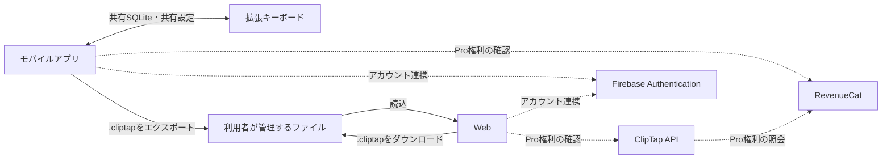
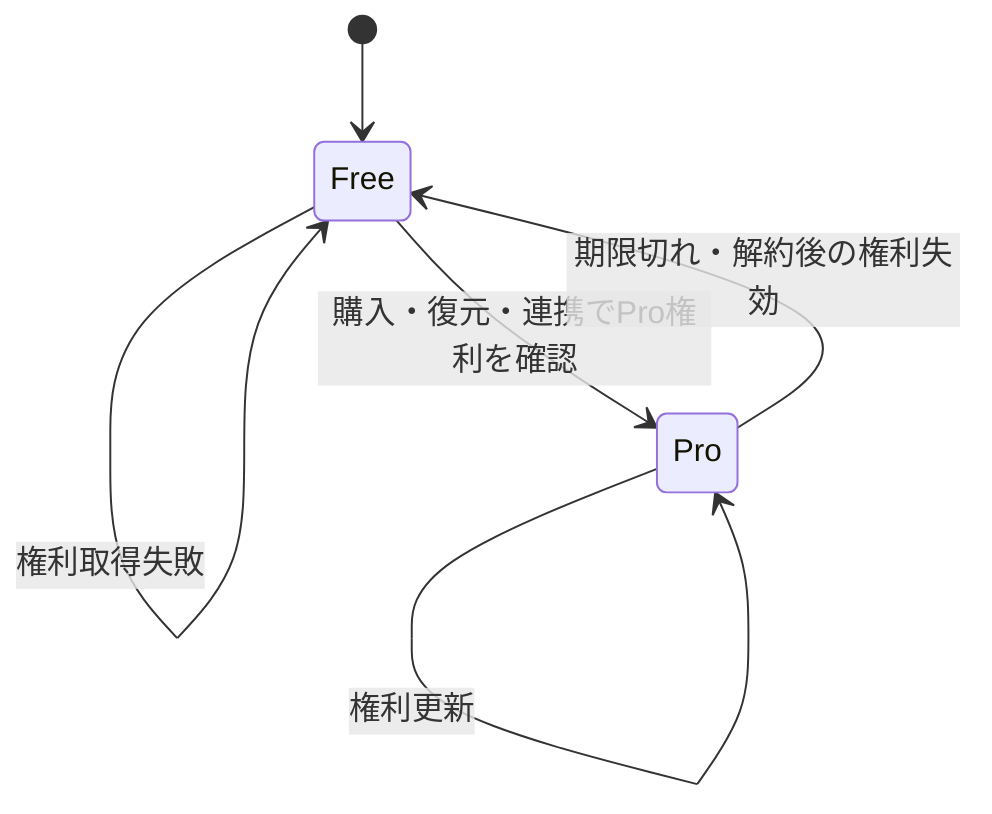
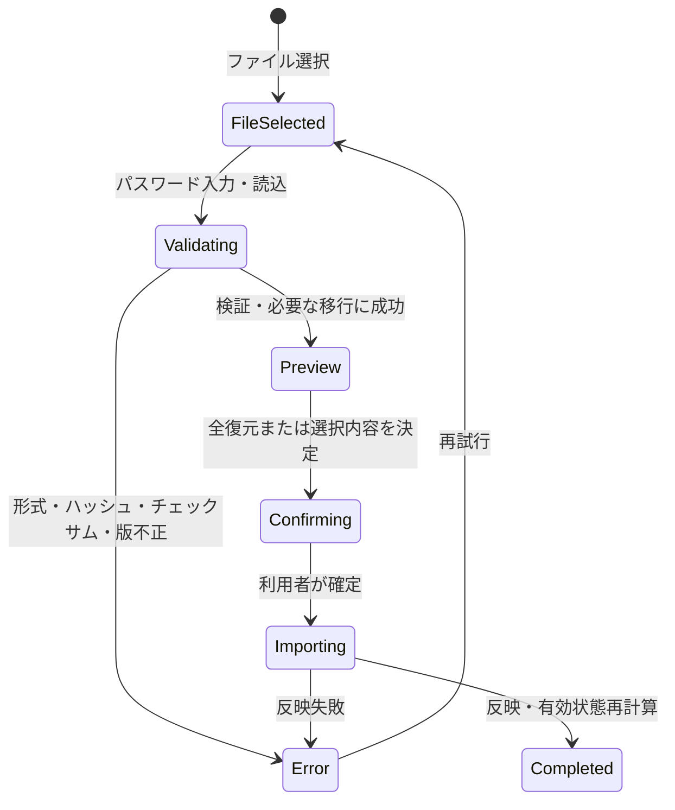
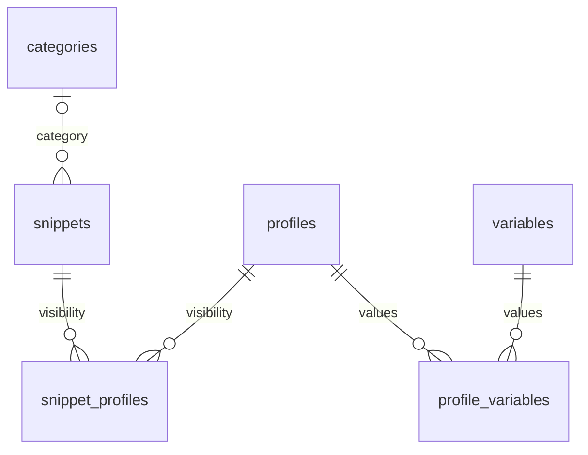

# ClipTap 機能仕様書

## 1. 文書情報

| 項目 | 内容 |
|---|---|
| 文書名 | ClipTap 機能仕様書 |
| 文書版 | 1.0 |
| 基準日 | 2026-08-03 |
| 対象アプリ版 | 1.2.1 |
| 対象データベース | SQLite スキーマ V6 |
| 対象プラットフォーム | iOS、Android、Web、iOS拡張キーボード、Android IME |
| 最低対応OS | iOS / iPadOS 15.1以上、Android 7.0（API 24）以上 |
| 正本 | 本書を機能仕様の正本とする |

### 1.1 本書の読み方

- 「共通」は、モバイルアプリとWebで同じ業務ルールを使用することを示す。
- 「モバイル」は、iOSとAndroidのメインアプリを示す。
- 「キーボード」は、iOS拡張キーボードとAndroid IMEを示す。
- 「現行」は基準日時点のリポジトリで確認できる動作、「方針」は今後も維持するべき製品上の要件を示す。
- 実装と本書が異なる場合は、差分を第15章へ記録し、実装変更と同じ変更単位で本書を更新する。

### 1.2 仕様の優先順位

1. 法令、ストア規約、公開済みの利用規約・プライバシーポリシー
2. 本書
3. 開発・運用手順書
4. コメント、過去の設計書、テストメモ

第1項と現行実装が矛盾する場合は、黙ってどちらかへ合わせず、第15章の課題として扱う。

## 2. 目的・位置づけ

ClipTapは、定型文をローカルで管理し、利用場面に応じて変数を展開して、クリップボードまたは拡張キーボードから素早く入力するためのアプリケーションである。

本書の目的は次のとおり。

- 利用者から見える機能、制約、エラー、プラットフォーム差を一つの文書で確認できるようにする。
- モバイル、Web、キーボードで共有する業務ルールを定義する。
- 外部サービス、ファイル形式、データベース、非機能要件の境界を明確にする。
- 旧文書に分散していた現行仕様を統合し、将来案と実装済み機能を混在させない。

本書は外部設計レベルの仕様であり、画面内部のコンポーネント構成、クラス、関数、ソースコードの配置は定義しない。

## 3. システム概要

### 3.1 提供形態

| 提供形態 | 主な役割 | データの置き場所 |
|---|---|---|
| iOS / Androidアプリ | 定型文・カテゴリ・プロファイル・変数の管理、コピー、入出力、購入・復元 | 端末内SQLite |
| iOS拡張キーボード | 共有データの検索・絞り込み・展開・入力 | App Group内の共有SQLiteと共有設定 |
| Android IME | 共有データの検索・絞り込み・展開・入力 | アプリと共有するSQLiteと共有設定 |
| Web | `.cliptap`ファイルの読込、PCでの管理、再エクスポート | ブラウザ内SQLite WASMとローカルキャッシュ |
| ランディングページ | 製品紹介、法的文書、ストア導線 | 静的Web配信 |

### 3.2 基本方針

- 定型文などの業務データはローカルファーストで扱う。
- アカウント連携はPro権利の共有に使用し、業務データをクラウド同期しない。
- キーボードは業務データの作成・編集・削除を行わない。表示、変数展開、入力、および条件を満たす場合の使用回数更新だけを行う。
- Webはサーバー側データベースを持たず、利用者が読み込んだデータをブラウザ内で処理する。
- 日本語と英語を提供し、原則として端末またはブラウザの言語に従う。

### 3.3 データの流れ

ファイル交換は利用者の明示操作で行う。モバイルとWebの間に自動同期はない。

## 4. 対象範囲・前提

### 4.1 対象範囲

- 定型文、カテゴリ、プロファイル、カスタム変数の管理
- システム変数・カスタム変数の展開
- 検索、絞り込み、並べ替え、プレビュー、コピー、キーボード入力
- `.cliptap`による全件・選択データのエクスポートとインポート
- Free / Proの機能制御、購入、復元、アカウント連携
- 広告、トラッキング同意、テーマ、言語、法的文書
- ローカルデータベースとスキーマ移行
- Webの静的配信とブラウザ内キャッシュ

### 4.2 対象外

- 定型文データのクラウド同期、共同編集、サーバーバックアップ
- WebからのPro購入・解約
- キーボードからの業務データCRUD
- 通知、定期実行、バックグラウンド同期
- 管理者用画面、組織・ロール管理、監査ログ
- ファイルの強固な暗号化、パスワード再発行
- Webの `file://` 直接起動。WebはHTTPまたはHTTPS配信を前提とする。

### 4.3 動作前提

- モバイルの業務機能は、外部認証なしでも利用できる。
- キーボードの初回利用前に、メインアプリを一度起動してデータベースと共有状態を初期化する。
- iOSで使用回数を書き込むには、キーボードのフルアクセス許可と使用頻度追跡の有効化が必要である。
- Webの初回利用では、対象ファイル、同ファイルに設定したパスワード、利用規約・プライバシーポリシーへの同意が必要である。ブラウザに有効なキャッシュがあれば復元できる。
- 認証、サブスクリプション、広告、ストア画面の利用にはネットワーク接続が必要である。

## 5. 用語

| 用語 | 定義 |
|---|---|
| 定型文（snippet） | 再利用するタイトルと本文。0個以上のカテゴリ、プロファイル、変数と関連する。カテゴリは最大1件。 |
| カテゴリ | 定型文を色と名称で分類する単位。削除しても定型文は削除されない。 |
| プロファイル | 利用場面ごとの変数値と定型文表示範囲を切り替える単位。旧文書の「環境」と同義。 |
| 標準プロファイル | 初期作成され、削除できない基準プロファイル。 |
| アクティブプロファイル | 現在の変数値と定型文絞り込みに使用する有効なプロファイル。 |
| システム変数 | 日付・時刻などを実行時に生成する予約変数。データベースには保存しない。 |
| カスタム変数 | 利用者が名前とプロファイル別の値を登録する変数。 |
| 標準値 | カスタム変数に対する標準プロファイルの値。アクティブプロファイル固有値がない場合のフォールバックになる。 |
| 変数トークン | `{{name}}` 形式で定型文に埋め込む置換対象。 |
| 有効 / 無効 | 現在のプラン上限内で使用できるかを表す状態。無効でもデータは削除しない。 |
| 使用回数 | 定型文をコピーまたはキーボード入力した回数。対応条件を満たす経路だけが加算する。 |
| 全復元 | 現在の業務データを削除し、ファイル内容を取り込むインポート方式。 |
| 選択インポート | 現在のデータを残し、選択したデータと必要な関連を追加・統合する方式。 |
| `.cliptap` | SQLiteバイナリをJSONで包んだClipTap交換ファイル。暗号化形式ではない。 |
| App Group | iOSアプリと拡張キーボードがデータベース・設定を共有するOS領域。 |

## 6. 利用者・権限・プラン

### 6.1 利用者区分

| 区分 | 認証 | 利用可能範囲 |
|---|---|---|
| ゲスト | なし | ローカル業務機能、Free機能。Webもファイルを読み込めば利用可能。 |
| 連携済み利用者 | GoogleまたはApple | ゲスト機能に加え、同じFirebase UIDを介したPro権利の確認。業務データ同期はしない。 |
| Pro利用者 | RevenueCatの `Pro` entitlementが有効 | 広告非表示、プロファイル・カスタム変数の上限解除。 |

Apple認証はiOSモバイルとWeb、Google認証はiOS・AndroidモバイルとWebで提供する。認証プロバイダーが利用できない環境では、その選択肢を表示しないかエラーを案内する。

### 6.2 Free / Pro比較

| 項目 | Free | Pro |
|---|---:|---:|
| 定型文 | 上限なし | 上限なし |
| カテゴリ | 上限なし | 上限なし |
| 有効なプロファイル | 3件まで | 上限なし |
| 有効なカスタム変数 | 5件まで | 上限なし |
| 広告 | モバイルはAdMob、WebはA8.netを表示 | 非表示 |
| エクスポート / インポート | 利用可 | 利用可 |
| アカウント連携 | 利用可 | 利用可 |
| Web編集 | 利用可 | 利用可 |
| キーボード | 現行実装では利用可 | 利用可 |

有効件数は標準プロファイルを優先し、その後は表示順で判定する。Freeへ変更したときは上限超過分を物理削除せず無効にする。無効になったプロファイルがアクティブだった場合は、標準プロファイルへ切り替える。Proへ戻したときは保存済みデータを再び有効化する。

> 公開中の法的文書・一部課金表示に「キーボードはPro限定」と読める記述がある一方、現行実装はFreeでも利用できる。製品方針の確定が必要であり、第15章に記載する。

### 6.3 価格と課金

- 現行UIの基準価格は月額250円、年額3,000円である。
- 実際の価格、通貨、無料トライアル、販売可否はストアおよびRevenueCat Offeringの値を優先する。
- 購入、購入復元、サブスクリプション管理画面への遷移はモバイルだけが提供する。
- WebはログインしたUIDの権利確認を行えるが、購入処理は行わない。
- 権利取得に失敗した場合、画面上はFree扱いにする。ただし現行の失敗経路ではDBの有効状態再計算とキーボード共有状態の更新が保証されず、直前の状態が残り得る。既存のローカルデータは削除しない。

### 6.4 アカウント連携時の期待結果

| 連携前の端末 | 連携先アカウント | 期待結果 |
|---|---|---|
| Free | Free | Free |
| Free | Pro | Pro |
| Pro | Free | Proを維持することを期待 |
| Pro | Pro | Pro |

購入履歴の転送・統合方法や採用される有効期限はRevenueCat側のRestore Behavior設定に依存する。アカウント連携を解除してもローカル業務データは消去しない。

## 7. 機能一覧

| ID | 機能 | モバイル | Web | キーボード |
|---|---|:---:|:---:|:---:|
| F-01 | 初期化・データ読込 | ○ | ○ | ○ |
| F-02 | 定型文CRUD | ○ | ○ | 参照のみ |
| F-03 | カテゴリCRUD | ○ | ○ | 参照のみ |
| F-04 | プロファイルCRUD・切替 | ○ | ○ | 切替・参照 |
| F-05 | カスタム変数CRUD・値設定 | ○ | ○ | 参照のみ |
| F-06 | システム変数展開 | ○ | ○ | ○ |
| F-07 | 検索 | ○ | ○ | ― |
| F-08 | カテゴリ・プロファイル絞り込み | ○ | ○ | ○ |
| F-09 | 並べ替え | ○ | ○ | ○ |
| F-10 | プレビュー | ○ | ○ | ○ |
| F-11 | コピー・キーボード入力 | コピー | コピー | 入力 |
| F-12 | 使用回数記録 | 条件付き | ― | 条件付き |
| F-13 | 全件・選択エクスポート | ○ | ○ | ― |
| F-14 | 全復元・選択インポート | ○ | ○ | ― |
| F-15 | Webワークスペース・キャッシュ | ― | ○ | ― |
| F-16 | アカウント連携・解除 | ○ | ○ | ― |
| F-17 | 購入・復元・管理 | ○ | 状態確認のみ | ― |
| F-18 | プラン上限再計算 | ○ | ○ | 結果参照 |
| F-19 | 広告・トラッキング同意 | ○ | ○ | ― |
| F-20 | テーマ・言語 | ○ | ○ | ○ |
| F-21 | 法的文書・アプリ情報 | ○ | ○ | ― |
| F-22 | キーボード設定・状態案内 | ○ | ― | ○ |

`―` は対象外を示す。キーボードの「参照」は、メインアプリで保存した有効データの利用を指す。

## 8. 機能仕様

### 8.1 初期化・データ読込（F-01）

#### モバイル

1. 共有データベースを開く。
2. 未作成ならV6スキーマ、インデックス、標準プロファイル `Main` を作成する。
3. 既存スキーマが古い場合は順番に移行する。
4. 保存済みのプラン、使用頻度設定、アクティブプロファイルを読み込む。
5. 外部サービスの初期化失敗は業務データの読込を妨げず、利用可能な範囲でFreeとして継続する。

#### Web

1. 有効なブラウザキャッシュがある場合は、同一ブラウザのワークスペースを復元する。
2. キャッシュがない場合は、`.cliptap`ファイルとパスワードの入力、利用規約・プライバシーポリシーへの同意を求める。
3. モバイルアプリを持たない利用者向けに、同画面でサンプルデータ入りのベースファイルを配布する。利用者はダウンロードしたファイルを同じ手順で読み込むことで利用を開始できる。
4. ファイルを検証し、SQLite WASMへ読み込む。
5. 認証のログイン・ログアウトをまたいでも同じローカルキャッシュを使用する。UID別の業務データ分離は行わない。

##### ベースファイル

| 項目 | 仕様 |
|---|---|
| 配布物 | Webの静的配信物に同梱する `starter_v{スキーマバージョン}_{言語}.cliptap` |
| 言語 | 表示言語に応じて日本語版・英語版を切り替える。非対応言語は英語版とする |
| 内容 | 標準プロファイル `Main`、カテゴリ1件、カスタム変数2件、定型文「日報テンプレート」1件。カテゴリとカスタム変数は日報テンプレートに組み込み、システム変数とあわせて動作を確認できる構成とする |
| パスワード | 公開サンプルのため固定値とし、読込画面に表示する。ダウンロード時にパスワード欄が空であれば自動入力する |
| 生成 | 実装のスキーマ定義とエクスポート形式から生成する。スキーマバージョン更新時は再生成し、ファイル名のバージョンを一致させる |

#### キーボード

- 共有データベースが未初期化の場合は、メインアプリを開くよう案内する。
- 共有されたサブスクリプション状態が `ACTIVE` または `FREE` の場合に定型文を表示する。
- `EXPIRED` または `NO_DATA` の場合は入力機能をブロックし、メインアプリで状態を更新するよう案内する。

### 8.2 定型文管理（F-02）

| 項目 | 仕様 |
|---|---|
| 作成・編集 | タイトル、本文、カテゴリ、対象プロファイル、タイトル同時コピーを設定する。 |
| タイトル | 画面上は必須。Webは30文字まで。モバイルの30文字制限は現状一貫して強制されない。 |
| 本文 | 画面上は必須。システム変数・カスタム変数を挿入できる。現行では文字数上限を設けない。 |
| カテゴリ | 任意。1件だけ関連付けられる。 |
| 対象プロファイル | 0件以上。関連が0件の場合は「すべてのプロファイル」で表示する。 |
| タイトル同時コピー | ONなら展開後のタイトル、改行、展開後の本文を連結する。OFFなら本文だけを対象にする。 |
| 削除 | 定型文本体とプロファイル関連を物理削除する。カテゴリ、プロファイル、変数本体は削除しない。 |
| 更新日時 | 内容を更新したときに更新する。コピーだけでは更新しない。 |

モバイルは段階的な入力画面、Webはモーダルで編集する。離脱時に未保存入力がある場合は「入力途中のデータがあります。破棄してもよろしいですか？」と確認する。

### 8.3 カテゴリ管理（F-03）

- 名称は必須、20文字以内、重複不可とする。
- 色は12種類のプリセットまたはRGB各0～255のカスタム色から選択できる。
- 一覧順を保持し、並べ替えできる。
- カテゴリ削除時は、関連する定型文を削除せず `未分類` にする。
- カテゴリ未指定の定型文は `未分類` として絞り込みできる。

### 8.4 プロファイル管理（F-04）

- 名称は必須、20文字以内、重複不可とする。
- 初期データでは `Main` が標準かつアクティブである。
- 標準プロファイルは削除できない。
- 有効なプロファイルのうち1件をアクティブにする。
- アクティブな非標準プロファイルを削除した場合は標準へ切り替える。
- 削除時は、そのプロファイルの変数値と定型文関連を物理削除する。定型文・変数本体は削除しない。
- 表示順を保持し、並べ替えできる。
- Freeでは標準プロファイルを優先して合計3件まで有効にする。上限超過分は表示を残したまま無効にする。

### 8.5 カスタム変数管理（F-05）

| 項目 | 仕様 |
|---|---|
| 名前 | 必須。英字または `_` で始まり、以降は英数字または `_`。システム予約名は英字の大小を区別せず判定する。現行のカスタム変数重複判定は大小を区別するため、`Foo` と `foo` が共存できる。 |
| UI上の長さ | モバイル・Webとも30文字までを想定する。業務層の上限50文字との差は第15章の課題。 |
| 表示ラベル | キーボード等で利用者に見せる名称。モバイルでは必須、Webでは任意となっており統一が必要。 |
| アイコン | 選択可能。新規作成時の保存不備は第15章の課題。 |
| 値 | 標準値または1件以上のプロファイル別値を登録する。空文字の扱いは入力画面の必須判定に従う。 |
| 表示順 | 保持し、並べ替えできる。 |
| 削除 | 変数本体と全プロファイル値を物理削除する。定型文中のトークンは書き換えない。 |
| 名前変更 | 定型文中の既存トークンは自動更新しない。 |
| Free制限 | 表示順で5件まで有効。超過分は削除せず無効にする。 |

予約名は第8.6節の日本語・英語エイリアスを含む。無効な変数は管理画面に残すが、通常の展開候補やキーボード利用から除外する。

### 8.6 システム変数展開（F-06）

| 英語名 | 日本語名 | 出力例・形式 |
|---|---|---|
| `today` | `今日` | `2026/08/03`（`YYYY/MM/DD`） |
| `now` | `現在` | `2026/08/03 14:30:45`（`YYYY/MM/DD HH:mm:ss`） |
| `time` | `時刻` | `14:30`（`HH:mm`） |
| `year` | `年` | `2026`（`YYYY`） |
| `month` | `月` | `08`（`MM`） |
| `day` | `日` | `03`（`DD`） |
| `weekday` | `曜日` | 日本語は `日`～`土`、英語は `Sun`～`Sat` |

- トークン形式は `{{today}}` のように二重波括弧で囲む。
- モバイル・Webでは英語名をASCIIの大小を区別せず、日本語名を完全一致で解決する。
- システム変数を先に、次にカスタム変数を展開する。
- 日付・時刻は、プレビュー・コピー・入力を実行した時点の端末またはブラウザのローカル時刻を使用する。
- モバイルのメインアプリとWebでは、カスタム変数を「有効なアクティブプロファイルの値」→「標準プロファイルの値」→「元トークン」の順で解決する。
- 現行ネイティブキーボードはアクティブプロファイルの値だけを読み、標準プロファイルへフォールバックしない。対応エイリアスと未設定値にも経路差があり、第15章に記載する。

### 8.7 検索・絞り込み（F-07、F-08）

- 検索は保存済みの未展開タイトルと本文を、大文字・小文字を区別しない部分一致で評価する。変数の展開結果は検索対象にしない。
- モバイル検索画面は入力から300ミリ秒デバウンスして評価する。Webは現行、入力変更のたびに即時評価する。
- 空の検索語は全件を対象とする。
- Webはカテゴリを「すべて」「未分類」または個別カテゴリで絞り込む。モバイルホームは「すべて」と、そのプロファイルで定型文が存在する個別カテゴリだけを表示し、未分類専用チップを表示しない。未分類の定型文は「すべて」に含める。
- プロファイルはアクティブプロファイルを基準とし、関連なしの定型文はすべてのプロファイルで表示する。
- カテゴリとプロファイルの条件を同時に指定した場合はAND条件とする。
- 無効なプロファイル・変数は通常の選択肢および展開対象から除外する。
- Webの変数管理画面は7種類のシステム変数を読取専用で併記する。モバイルの変数管理一覧はカスタム変数だけを表示する。

### 8.8 並べ替え（F-09）

| 種別 | 順序 | 同値時 |
|---|---|---|
| 作成日時 | 新しい順 | タイトル順 |
| 更新日時 | 新しい順 | タイトル順 |
| タイトル | 昇順 | 作成日時の新しい順 |
| 使用頻度 | 使用回数の多い順 | 作成日時の新しい順 |

- 初期値は作成日時順とする。
- 選択はモバイル、Web、キーボードごとにローカル保存する。
- iOSで使用頻度追跡が無効な場合、モバイルは使用頻度順を無効表示し、設定方法を案内する。
- タイトルがNULLの旧データは、モバイル・Webの共通取得では末尾、現行ネイティブキーボードのタイトル昇順ではSQLite既定により先頭になる。

### 8.9 プレビュー・コピー・キーボード入力（F-10～F-12）

#### 共通

1. 選択時点の日時とアクティブプロファイルで変数を展開する。
2. `タイトルもコピーする` がONでタイトルがある場合は、`展開済みタイトル + 改行 + 展開済み本文` を生成する。
3. OFFの場合またはタイトルがない場合は、展開済み本文を生成する。
4. 展開できないトークンは原則として元の形を残す。

#### モバイル

- 生成テキストをOSクリップボードへ保存する。
- 成功時に軽い触覚フィードバックを行い、コピー済み表示を約2秒間表示する。
- モバイルホームからのコピーでは、Androidは使用回数を加算し、iOSはフルアクセス許可済みかつ使用頻度追跡ONの場合に加算する。
- モバイル検索画面からのコピーは現行では使用回数を加算しない。

#### Web

- ブラウザのクリップボードAPIへ保存する。
- 成功表示を約2秒間表示する。触覚フィードバックは行わない。
- 現行Webは使用回数を加算しない。
- クリップボード権限や安全なコンテキストの要件を満たさない場合はエラーを表示する。

#### キーボード

- 生成テキストを現在フォーカス中の入力欄へ挿入し、触覚フィードバックを行う。
- iOSは使用頻度追跡ONの場合だけ使用回数を加算する。
- Androidは挿入成功時に使用回数を加算する。
- キーボードは定型文件数をFree向けに10件へ制限していない。過去の未使用経路にある制限定数は現行仕様としない。

### 8.10 エクスポート（F-13）

- 全データまたは選択データをエクスポートできる。
- ファイル名は `export_YYYYMMDDHHMMSS.cliptap` とする。
- パスワードは空白だけでないことを画面で確認する。8文字以上の制約は現行では適用していない。
- モバイルはOS共有シート、Webはブラウザのダウンロードを利用する。
- 選択エクスポートでは、選択外の業務データと不要な関連を一時コピーから除外する。選択外カテゴリに属する定型文は未分類として扱う。
- 出力ファイルは第12章の形式とする。パスワードは誤入力検知用ハッシュに使用するが、内容の暗号化には使用しない。

### 8.11 インポート（F-14）

#### 共通検証

- 拡張子が小文字の `.cliptap` であることを確認する。
- JSONとして解析し、パスワードハッシュ、データの復号、存在する場合のチェックサムを検証する。現行処理はトップレベル全項目の型・必須性やSQLiteヘッダーをスキーマ検証していない。
- ファイルのスキーマがV6より新しい場合は拒否する。
- モバイルおよび読込済みワークスペースのインポートでは、対応可能な古いスキーマを一時データベース上でV6へ移行してからプレビューする。
- Web初期画面からの最初のファイル読込は、現行では旧スキーマ移行を行わず復号済みDBを直接開く。この経路差は第15章の課題とする。
- 検証中は現在の業務データを変更しない。

#### 全復元

1. 「現在のデータは全て削除されます。本当によろしいですか？」と確認する。
2. 現在のカテゴリ、定型文、プロファイル、変数、関連データを削除する。
3. ファイル内データを再作成し、関連を復元する。
4. プラン上限に基づき有効状態を再計算する。

現行処理は、ID・日時・使用回数まで同一に戻すバイト単位の復元ではない可能性がある。第15章で「完全復元」の定義を確定する。

#### 選択インポート

- 定型文、カテゴリ、プロファイル、変数をタブごとに選択できる。
- 定型文は常に新規IDで追加する。
- 同名のカテゴリ、プロファイル、変数は既存データを再利用または値を更新し、重複作成しない。
- インポート元IDを取込先IDへ変換して関連を再構築する。
- 変数値は対象の変数とプロファイルの両方が選択または既存へ対応付けできた場合に取り込む。
- 選択しないカテゴリは、取込先に同名カテゴリがあれば関連付け、なければ未分類にする。
- 選択しないプロファイルは、取込先に同名プロファイルがあれば関連付ける。
- インポート元の標準・アクティブ情報は、取込先で標準またはアクティブが必要な場合に利用する。
- 現在のデータを保持したまま、選択した内容だけを追加・統合する。

### 8.12 Webワークスペース・キャッシュ（F-15）

- Webはランディングページとアプリ画面を分離した静的な複数エントリ構成とする。
- アプリ画面はダッシュボード、カテゴリ、プロファイル、変数の各管理画面を提供する。
- SQLite WASMとOPFSでローカル処理し、変更後のデータベースを300ミリ秒のデバウンスでIndexedDBへ自動キャッシュする。
- ブラウザが提供するOPFS・IndexedDBを利用し、サーバーへ業務データを送信しない。
- ログイン状態にかかわらず同じブラウザキャッシュを使う。
- `ファイルを閉じる` 操作でワークスペースを閉じ、初期読込画面へ戻る。
- 元ファイルへ直接上書きしない。変更結果はエクスポートして利用者が保存する。

### 8.13 アカウント・サブスクリプション（F-16～F-18）

- GoogleまたはAppleで認証し、Firebase UIDをRevenueCatの利用者識別へ連携する。
- 連携後に購入権利を再確認し、必要に応じて復元する。
- `Pro` entitlementが有効ならPro、その他はFreeとする。
- 連携解除時は匿名状態へ戻すが、端末内の業務データやWebキャッシュを削除しない。
- ログインの有無を、定型文などのローカルデータへのアクセス条件にしない。
- プラン変更時はプロファイル・変数の有効状態を再計算し、キーボードへ権利状態を共有する。
- 外部サービス障害時は画面をFreeとして継続し、購入済みデータ自体は削除しない。現行は有効状態とキーボード共有状態が直前値のまま残り得る。

### 8.14 広告・トラッキング同意（F-19）

- 広告はFreeのモバイルホーム画面下部にアダプティブバナーとして表示する。
- Proでは広告領域を表示しない。
- iOSはATT許可が得られた場合にパーソナライズ広告、拒否・制限・取得失敗の場合に非パーソナライズ広告を要求する。
- Androidは現行実装で非パーソナライズ広告を要求する。
- WebのFreeではサイドメニューにA8.netのアフィリエイト広告を表示し、Proでは非表示にする。WebはAdMobやATTを使用しない。
- 広告初期化や取得に失敗しても業務機能は継続する。

### 8.15 テーマ・言語・法的文書（F-20、F-21）

| 項目 | モバイル | Web | キーボード |
|---|---|---|---|
| テーマ | OSのライト・ダーク設定に追従 | 初回はOS設定。メニューでライト・ダークを切替えて保存 | キーボード環境の外観に追従 |
| 言語 | 端末言語から日本語・英語を選択 | ブラウザ言語から日本語・英語を選択 | OS言語から日本語・英語を選択 |
| 手動言語切替 | 現行UIなし | 現行UIなし | 現行UIなし |
| 法的文書 | 設定から利用規約・プライバシーポリシーを表示 | 初期同意と公開ページを提供 | メインアプリへ誘導 |

表示文字列が未定義の場合は英語または既定文言へフォールバックする。法的文書はモバイル同梱版と公開Web版の内容を同期する。

### 8.16 キーボード設定・状態案内（F-22）

- メインアプリからOSのキーボード追加手順へ誘導する。
- iOSはキーボード有効化、フルアクセス、使用頻度追跡の状態を案内する。
- iOSの使用頻度追跡は利用者が明示的にON/OFFでき、未設定かつフルアクセスありの場合はONとして扱う。フルアクセスなしでは加算せず、使用頻度順を作成日時順へ戻す。Androidにはフルアクセス相当の制限がない。
- キーボードはプレビュー、プロファイル切替、カテゴリ絞り込み、4種の並べ替えを提供する。現行キーボードにテキスト検索UIはない。
- キーボードから設定が必要な場合はメインアプリまたはOS設定へ誘導する。

## 9. 画面仕様

### 9.1 モバイル画面

| 画面 | 主な表示・操作 | 主な遷移先 |
|---|---|---|
| 起動・スプラッシュ | DB初期化、移行、外部サービス初期化、エラー案内 | ホーム |
| ホーム | 定型文一覧、プロファイル・カテゴリ絞り込み、並べ替え、コピー、広告 | 検索、作成・編集、設定、入出力 |
| 検索 | 検索語、展開後の検索結果、コピー | 定型文編集、ホーム |
| 定型文作成・編集 | 入力ステップ、プレビュー、変数挿入、カテゴリ・プロファイル選択 | ホーム |
| タイトル入力 | タイトル、タイトル同時コピー | 内容入力 |
| 内容入力 | 本文、変数ツールバー | プレビュー・保存 |
| プロファイル選択 | 対象を複数選択、0件は全プロファイル | 定型文編集 |
| カテゴリ選択・編集 | カテゴリ選択、新規作成・編集 | 定型文編集 |
| 設定 | キーボード設定、各マスタ、アカウント、Pro、法的文書、版情報 | 各設定画面 |
| カテゴリ管理 | 一覧、追加、編集、色、削除、並べ替え | カテゴリ編集 |
| プロファイル管理 | 一覧、切替、追加、編集、削除、並べ替え、有効状態 | プロファイル編集 |
| プロファイル編集 | 名称、変数値、削除 | 変数値編集 |
| 変数管理 | 一覧、追加、編集、削除、並べ替え、有効状態 | 変数編集 |
| 変数編集 | 名前、ラベル、アイコン、標準値・プロファイル値 | プロファイル値編集 |
| エクスポート・インポート | 全件または選択、方式選択 | 選択画面、パスワード入力 |
| 選択エクスポート | 4種類のデータ選択、パスワード | OS共有シート |
| 選択インポート | プレビュー、4種類のデータ選択、重複案内 | 結果表示 |
| Paywall | Free / Pro比較、月額・年額購入、復元、法的リンク | 購入処理、管理画面 |
| サブスクリプション管理 | 現在の状態、ストア管理導線 | OSストア |
| Web表示 | 利用規約、プライバシーポリシー等 | 設定へ戻る |

### 9.2 Web画面

| 画面 | 主な表示・操作 |
|---|---|
| ランディングページ | 製品紹介、ストア導線、法的文書へのリンク |
| ファイル読込 | ドラッグ＆ドロップまたは選択、ベースファイルのダウンロード導線とパスワード表示、パスワード、規約・プライバシー同意、読込エラー |
| ダッシュボード | 定型文一覧、検索、カテゴリ・プロファイル絞り込み、1～3列表示、4種の並べ替え、コピー、CRUD |
| カテゴリ管理 | 一覧、追加、編集、削除、色、並べ替え |
| プロファイル管理 | 一覧、切替、追加、編集、削除、並べ替え、有効状態 |
| 変数管理 | 一覧、追加、編集、削除、値設定、並べ替え、有効状態 |
| サイドメニュー | 画面移動、テーマ切替、入出力、アカウント連携、Free向けA8.net広告、ファイルを閉じる |
| 入出力モーダル | 全件・選択エクスポート、全復元・選択インポート、確認、結果 |
| アカウント連携モーダル | Google / Apple認証、認証エラー、解除 |

Webのアプリ内画面はURLハッシュによって切り替え、静的ホスティングで直接配信できる構成とする。

### 9.3 キーボード画面

| 領域 | 主な表示・操作 |
|---|---|
| 状態案内 | 未初期化、権利状態不明・期限切れ、メインアプリへの誘導 |
| ヘッダー | アクティブプロファイル、カテゴリ、並べ替え、設定導線 |
| 一覧 | 展開済みタイトル・本文の概要、選択、スクロール |
| プレビュー | 展開結果、タイトル同時入力の結果、入力確定 |

狭いキーボード領域でも誤操作を避けられるタップ領域と読み上げラベルを確保する。

### 9.4 共通画面状態

- 読込中は重複操作を無効化し、進捗表示を行う。
- データ0件では対象に応じた空状態と追加導線を表示する。
- 無効データには `無効` バッジとPro案内を表示し、通常利用を禁止する。
- 削除、全復元、未保存離脱、アカウント解除は確認を行う。
- エラーは可能な限り利用者が次に取る操作を含める。

## 10. API・外部インターフェース

### 10.1 外部サービス一覧

| 外部先 | 用途 | 送受信する主な情報 | 障害時 |
|---|---|---|---|
| Firebase Authentication | Google / Apple認証、UID取得 | 認証トークン、UID、プロバイダー情報 | ゲストのまま業務機能を継続 |
| RevenueCat | Pro権利、Offering、購入、復元、顧客連携 | UIDまたは匿名ID、商品・購入情報、`Pro` entitlement | 画面はFree扱いで継続し再試行を案内。共有状態の直前値残存に注意 |
| ClipTap API | WebのPro権利判定の中継 | Firebase IDトークン、`Pro` entitlementの判定結果 | 画面はFree扱いで継続 |
| Apple App Store / Google Play | 課金、サブスクリプション管理 | ストア管理の購入情報 | ストアエラーを表示 |
| Google Mobile Ads | Free向けバナー広告 | 広告リクエスト、端末・同意状態に応じた情報 | 広告なしで継続 |
| A8.net | Web Free向けアフィリエイト広告 | 広告表示に必要なブラウザ通信 | 広告なしで継続 |
| Apple ATT | 広告トラッキング同意 | OSの許可状態 | 非パーソナライズとして継続 |
| OS共有機能 | クリップボード、共有、文書選択、キーボード入力 | 利用者が選択したテキスト・ファイル | 権限・読込エラーを表示 |
| ブラウザAPI | ファイル、クリップボード、OPFS、IndexedDB、ローカル設定 | 利用者が読み込んだデータとUI設定 | 対応ブラウザ・権限を案内 |

ClipTap固有のサーバーAPIは、WebのPro権利判定を中継するClipTap APIだけとする。FirebaseとRevenueCatは権利連携にだけ使用し、定型文本文やカスタム変数値を同期しない。ClipTap APIも業務データを一切扱わない。

ClipTap APIはCloudflare Workers上で動作し、次のエンドポイントを提供する。

| メソッド・パス | 用途 | 認証 | 応答 |
|---|---|---|---|
| `GET /health` | 稼働確認 | 不要 | 稼働状態と環境識別子 |
| `GET /subscription/status` | Pro権利の判定 | Firebase IDトークン（`Authorization: Bearer`） | 契約状態、期限、商品識別子、自動更新可否、購読管理URL |

Webは自身のUIDを送信しない。ClipTap APIが検証済みIDトークンの`sub`クレームからApp User IDを導出するため、他者のUIDを指定してPro状態を取得することはできない。RevenueCatの秘密鍵はWorkerのシークレットとして保持し、ブラウザへは配布しない。トークン欠落・検証失敗・上流エラーのいずれの場合もWebはFree扱いで継続する。

### 10.2 モバイルとキーボードの共有インターフェース

iOSの共有識別子は `group.com.sikakou.cliptap` とする。AndroidはアプリとIMEが同一アプリ領域のデータベースと共有設定を使用する。

| 共有対象 | 内容 |
|---|---|
| 共有SQLite | カテゴリ、定型文、プロファイル、変数、関連、使用回数 |
| `is_premium_subscriber` | Pro権利の真偽 |
| `subscription_expiry_date` | 取得できた権利期限 |
| `subscription_last_updated` | 権利状態の最終更新日時 |
| `keyboardHasFullAccess` | iOSキーボードのフルアクセス状態 |
| `usageTrackingEnabled` | 使用頻度追跡のON/OFF |
| `usageTrackingEnabledSet` | 利用者が追跡設定を明示したか |

共有データの書込み競合を避けるため、キーボードは業務データを編集せず、許可された場合の使用回数だけを短い処理で更新する。

### 10.3 Web環境設定

WebのビルドではFirebaseのAPIキー、認証ドメイン、プロジェクトID、ストレージバケット、メッセージ送信者ID、アプリIDに加え、ClipTap APIのベースURLを環境設定から受け取る。Webは課金プロバイダのSDKキーを保持しない。ベースURLが未設定の場合は権利判定を行わずFree扱いとする。秘密鍵やサービスアカウント資格情報をクライアントへ埋め込まない。

ClipTap APIは環境ごとに実行環境識別子、FirebaseプロジェクトID、`Pro` entitlement識別子を設定値として受け取り、RevenueCatの秘密鍵だけをシークレットとして受け取る。許可オリジンは本番配信ドメインに限定し、開発環境でのみローカル開発サーバーを追加する。

### 10.4 主な利用者向けエラー

| 条件 | 日本語表示 |
|---|---|
| タイトル未入力 | `タイトルを入力してください` |
| 本文未入力 | `内容を入力してください` |
| 変数名未入力 | `変数名を入力してください` |
| 変数値未入力 | `値を入力してください` |
| カテゴリ名重複 | `このカテゴリ名は既に登録されています` |
| プロファイル名重複 | `このプロファイル名は既に登録されています` |
| 変数名重複 | `「{name}」は既に存在します` |
| 変数名形式不正 | `変数名は英数字とアンダースコアのみ使用可能です` |
| システム変数名の使用 | `「{name}」はシステム変数のため使用できません` |
| ファイル未選択 | `ファイルが選択されていません` |
| 拡張子不正 | `.cliptapファイルを選択してください` |
| パスワード未入力 | `パスワードを入力してください` |
| パスワード不一致 | `パスワードが正しくありません` |
| チェックサム不一致 | `ファイルが破損しているか改竄されています。正しいバックアップファイルを選択してください。` |
| ファイル形式不正 | `無効なファイル形式です` |
| 新しいスキーマ | `現在の端末では対応していないバージョンです。アプリを最新バージョンに更新してから再度お試しください。` |
| 読込失敗 | `読み込みに失敗しました: {message}` |
| ファイル読込失敗 | `ファイルの読み込みに失敗しました` |
| ファイル書込失敗 | `ファイルの書き込みに失敗しました` |
| 選択なし | `インポートするデータが選択されていません` |
| 規約未同意 | `利用規約に同意してください` |
| プライバシー未同意 | `プライバシーポリシーに同意してください` |
| RGB範囲外 | `RGB値が無効です（0-255の範囲で入力してください）` |
| 標準プロファイル削除 | `標準のプロファイルは削除できません` |
| プロファイル上限 | `プロファイルの上限に達しました` |
| 変数上限 | `変数の上限に達しました` |
| 購入失敗 | `購入に失敗しました` |
| ログアウト失敗 | `ログアウトに失敗しました` |
| その他 | `エラーが発生しました` |

英語環境では同じ意味の英語メッセージを表示する。内部例外、SQL、認証トークン、ローカル絶対パスを利用者へ表示しない。

## 11. バッチ・JOB・通知

### 11.1 バッチ・JOB

サーバーバッチ、定期JOB、キュー処理は存在しない。次の処理は利用者操作または起動イベントに同期して実行する。

| 契機 | 処理 |
|---|---|
| アプリ起動 | DB初期化・移行、共有状態読込、外部サービス初期化 |
| プラン状態変化 | プロファイル・変数の有効状態再計算、キーボード共有状態更新 |
| Webデータ変更 | 300ミリ秒のデバウンス後にブラウザキャッシュ保存 |
| コピー・入力 | 条件を満たす場合に使用回数を更新 |
| インポート | 一時DBで検証・移行後、利用者確認を経て反映 |

### 11.2 通知

- Push通知、ローカル予約通知、メール通知は提供しない。
- 完了、警告、失敗は画面内表示、ダイアログ、トースト、触覚フィードバックで通知する。
- バックグラウンドで利用者へ通知する処理はない。

## 12. 帳票・ファイル入出力

### 12.1 `.cliptap`ファイル構造

トップレベルはUTF-8のJSONオブジェクトで、次のフィールドを持つ。

| フィールド | 型 | 必須 | 内容 |
|---|---|:---:|---|
| `s` | number | ○ | エクスポート元のDBスキーマバージョン |
| `t` | string | ○ | ISO 8601形式のエクスポート日時 |
| `h` | string | ○ | `SHA-256(password + ":" + s)` の16進文字列 |
| `d` | string | ○ | SQLiteバイナリをBase64化し、得た文字列を再度Base64化した値 |
| `c` | string | 現行出力は○ | `{s,t,h,d}`だけをこの順でJSON化した文字列のSHA-256 |

`customerId` やFirebase UIDは出力しない。ファイルはアカウントにひも付かず、正しいパスワードを知る利用者が読み込める。

### 12.2 セキュリティ特性

- Base64はエンコードであり暗号化ではない。ファイルを取得した第三者に対する機密性を保証しない。
- `h` は入力パスワードの一致確認、`c` は偶発破損・単純改変の検知に使用する。
- `c` は秘密鍵付き署名ではないため、意図的な改変に対する真正性を保証しない。
- パスワードを忘れた場合の復旧機能はない。
- ファイル共有・保存先のアクセス制御は利用者とOSに委ねる。

### 12.3 互換性

- 現行スキーマV6より新しいファイルは拒否する。
- 古いファイルは、対応する移行処理が完了した場合に読み込む。
- チェックサムを持つファイルは必ず検証する。現行読込経路はチェックサム欠落の旧形式を受理する場合がある。
- V1～V3ファイルの実用上の互換性は保証が不十分であり、第15章で対応範囲を確定する。
- 「アプリ版が完全一致しなければ拒否」ではなく、DBスキーマとファイル検証結果で判断する。

### 12.4 ベースファイル

- Web版は、モバイルアプリを持たない利用者の開始手段として、サンプルデータ入りの `.cliptap` を静的配信物に同梱する。
- 形式は12.1と同一であり、専用形式は設けない。
- パスワードは公開された固定値であり、機密性を目的としない。内容はサンプルデータのみで、利用者データを含まない。
- ファイル名にスキーマバージョンを含め、再生成漏れのまま古い内容が配信されないようにする。

### 12.5 帳票

印刷帳票、PDF、CSV、集計レポートは提供しない。唯一の業務データ交換形式は `.cliptap` である。

## 13. 状態・ステータス

### 13.1 サブスクリプション状態

| 状態 | 条件 | 主なUI |
|---|---|---|
| Free | `Pro` entitlementが無効または状態取得失敗 | 上限・広告・Pro案内 |
| Pro | `Pro` entitlementが有効 | 上限解除・広告非表示・管理導線 |

### 13.2 プロファイル・変数状態

| 状態 | 意味 | 操作 |
|---|---|---|
| 有効 | 現在プランの上限内 | 通常利用・編集可 |
| 無効 | Free上限を超過 | データ保持、通常利用不可、編集時にPro案内 |
| アクティブ | 現在の展開・絞り込み対象プロファイル | 有効な1件だけ |
| 標準 | 値フォールバックと上限判定で優先するプロファイル | 1件、削除不可 |

プラン変更時の再計算順は、プロファイルが標準優先の後に表示順、変数が表示順である。

### 13.3 キーボード権利状態

| 状態 | 意味 | 定型文入力 |
|---|---|---|
| `ACTIVE` | Pro権利あり | 可 |
| `FREE` | Freeとして確認済み | 現行は可 |
| `EXPIRED` | 共有された権利が期限切れ | 不可、メインアプリへ誘導 |
| `NO_DATA` | 共有状態なし | 不可、メインアプリ初回起動へ誘導 |

### 13.4 インポート状態

反映前の検証エラーでは現行データを変更しない。反映途中の原子性については第15章で保証範囲を確定する。

### 13.5 Webワークスペース状態

| 状態 | 条件 | 可能な操作 |
|---|---|---|
| 未読込 | キャッシュ・読込済みファイルなし | ファイル選択、同意、パスワード入力 |
| 読込中 | 検証・SQLite初期化中 | キャンセル以外を無効化 |
| 利用中 | DB利用可能 | CRUD、コピー、入出力、設定 |
| エラー | 読込・保存失敗 | 詳細確認、再試行、別ファイル選択 |

## 14. データベース設計・非機能制約

### 14.1 データベース概要

- エンジン: SQLite
- スキーマ: V6
- テーブル: 6
- インデックス: 8
- スキーマ版管理: SQLiteの `user_version`
- 日時: ISO 8601文字列
- 真偽値: `0` / `1` のINTEGER
- 主キー: アプリが生成するTEXT ID

### 14.2 ER概要

定型文とプロファイルの関連が0件なら全プロファイル向けと解釈する。

### 14.3 テーブル定義

#### `categories`

| 列 | 型 | NULL | 既定値・制約 | 内容 |
|---|---|:---:|---|---|
| `id` | TEXT | 不可 | 主キー | カテゴリID |
| `name` | TEXT | 不可 | 一意 | 名称 |
| `color` | TEXT | 可 | なし | 表示色 |
| `sortOrder` | INTEGER | 可 | 0 | 表示順 |
| `createdAt` | TEXT | 不可 | なし | 作成日時 |

#### `snippets`

| 列 | 型 | NULL | 既定値・制約 | 内容 |
|---|---|:---:|---|---|
| `id` | TEXT | 不可 | 主キー | 定型文ID |
| `title` | TEXT | 可 | なし | タイトル |
| `content` | TEXT | 不可 | なし | 本文 |
| `categoryId` | TEXT | 可 | カテゴリ削除時NULL | カテゴリID |
| `copyWithTitle` | INTEGER | 可 | 0 | タイトル同時コピー |
| `copyCount` | INTEGER | 可 | 0 | 使用回数 |
| `createdAt` | TEXT | 不可 | なし | 作成日時 |
| `updatedAt` | TEXT | 不可 | なし | 更新日時 |

#### `variables`

| 列 | 型 | NULL | 既定値・制約 | 内容 |
|---|---|:---:|---|---|
| `id` | TEXT | 不可 | 主キー | 変数ID |
| `name` | TEXT | 不可 | 一意 | トークン名 |
| `type` | TEXT | 不可 | なし | 変数種別 |
| `label` | TEXT | 可 | なし | 表示ラベル |
| `icon` | TEXT | 可 | なし | アイコン名 |
| `valid` | INTEGER | 可 | 1 | プラン上の有効状態 |
| `sortOrder` | INTEGER | 可 | 0 | 表示順 |
| `createdAt` | TEXT | 不可 | なし | 作成日時 |
| `updatedAt` | TEXT | 不可 | なし | 更新日時 |

#### `profiles`

| 列 | 型 | NULL | 既定値・制約 | 内容 |
|---|---|:---:|---|---|
| `id` | TEXT | 不可 | 主キー | プロファイルID |
| `name` | TEXT | 不可 | 一意 | 名称 |
| `isActive` | INTEGER | 可 | 0 | アクティブ状態 |
| `isDefault` | INTEGER | 可 | 0 | 標準状態 |
| `valid` | INTEGER | 可 | 1 | プラン上の有効状態 |
| `sortOrder` | INTEGER | 可 | 0 | 表示順 |
| `createdAt` | TEXT | 不可 | なし | 作成日時 |
| `updatedAt` | TEXT | 不可 | なし | 更新日時 |

#### `profile_variables`

| 列 | 型 | NULL | 既定値・制約 | 内容 |
|---|---|:---:|---|---|
| `id` | TEXT | 不可 | 主キー | プロファイル変数値ID |
| `profileId` | TEXT | 不可 | プロファイル削除時CASCADE、一意組合せ | プロファイルID |
| `variableId` | TEXT | 不可 | 変数削除時CASCADE、一意組合せ | 変数ID |
| `value` | TEXT | 不可 | なし | 値 |
| `createdAt` | TEXT | 不可 | なし | 作成日時 |
| `updatedAt` | TEXT | 不可 | なし | 更新日時 |

`profileId` と `variableId` の組合せは一意とする。

#### `snippet_profiles`

| 列 | 型 | NULL | 既定値・制約 | 内容 |
|---|---|:---:|---|---|
| `snippetId` | TEXT | 不可 | 複合主キー、定型文削除時CASCADE | 定型文ID |
| `profileId` | TEXT | 不可 | 複合主キー、プロファイル削除時CASCADE | プロファイルID |

外部キー定義は存在するが、実行時の外部キー強制設定は現行コードから確認できない。削除時の整合性は業務処理による明示更新・削除でも維持する。

### 14.4 インデックス

| 名称 | 対象列 | 目的 |
|---|---|---|
| `idx_snippets_category` | `snippets.categoryId` | カテゴリ絞り込み |
| `idx_snippets_updated` | `snippets.updatedAt DESC` | 更新日時順 |
| `idx_snippets_copy_count` | `snippets.copyCount DESC` | 使用頻度順 |
| `idx_profiles_active` | `profiles.isActive DESC` | アクティブ取得 |
| `idx_profile_variables_profile` | `profile_variables.profileId` | プロファイル別値取得 |
| `idx_profile_variables_variable` | `profile_variables.variableId` | 変数別値取得 |
| `idx_snippet_profiles_snippet` | `snippet_profiles.snippetId` | 定型文の対象取得 |
| `idx_snippet_profiles_profile` | `snippet_profiles.profileId` | プロファイル別定型文取得 |

### 14.5 マイグレーション

| 移行 | 変更 |
|---|---|
| V1 → V2 | タグ関連を廃止し、旧定型文列とカテゴリのアイコン列を整理。変数、プロファイル、各関連を追加。標準プロファイルを作成。 |
| V2 → V3 | タイトル同時コピーを追加。 |
| V3 → V4 | モバイルDBをキーボードと共有する領域へ移行。 |
| V4 → V5 | プロファイルと変数に表示順を追加し、既存データの順序を設定。 |
| V5 → V6 | 定型文に使用回数と使用頻度用インデックスを追加。 |

移行は昇順に実行し、成功した版だけを保存する。新規データベースは直接V6で作成する。

### 14.6 非機能要件

#### 可用性・オフライン

- CRUD、検索、変数展開、コピー、キーボード入力はローカルデータだけで完結する。
- 認証、課金、広告、ストア遷移、Webの初回静的資産取得はネットワーク依存とする。
- 外部サービス障害でローカル業務データを失わない。

#### 性能

- モバイル検索入力は300ミリ秒でデバウンスする。Webは現行即時評価であり、統一方針は第15章で決定する。
- Webキャッシュ保存は300ミリ秒でデバウンスし、連続編集の書込みをまとめる。
- カテゴリ、更新日時、使用回数、関連取得には索引を使用する。
- コピー・キーボード入力は利用者が待ち時間を意識しない応答を目標とする。

#### セキュリティ・プライバシー

- 業務データは原則端末・ブラウザ内に保存し、FirebaseやRevenueCatへ送信しない。
- `.cliptap`は暗号化されないため、機密情報を含むファイルの保管・送信にはOS側の保護を必要とする。
- 認証トークン、秘密鍵、内部エラー、絶対パスをログや利用者表示へ含めない。
- 広告トラッキングはOS同意状態に従う。
- 法的文書と実際の収集・送信・プラン制御を一致させる。

#### アクセシビリティ・表示

- iOSは電話・タブレットで縦向きを基本対応とする。
- AndroidはAPI 24以上の端末幅へレスポンシブに対応する。
- Webは1～3列の切替と画面幅に応じたレイアウトを提供する。
- 操作要素には読み上げ可能な名称、十分なタップ領域、状態が色だけに依存しない表示を用いる。
- ライト・ダーク双方でコントラストと視認性を維持する。

#### 保守・配布

- アプリ版、DB版、最低OS、本書を同じ変更で更新する。
- Webは `release/prod` へのpushまたは手動実行でビルドし、GitHub Pagesへ配布する。
- Webの公開ドメインは `cliptap.net` とする。
- 旧Vercel設定は現行配布経路ではない残存物として扱う。
- ビルドに必要な公開設定と秘密情報を区別し、秘密情報をリポジトリへ登録しない。

## 15. 未確定事項

以下は基準日時点で、製品方針、文書、またはプラットフォーム実装が一致していない事項である。解決時は実装・テスト・本書・法的文書を同じ変更単位で更新する。

| ID | 未確定・不整合 | 現状と影響 | 推奨する決定 |
|---|---|---|---|
| U-01 | Freeキーボードの扱い | 現行キーボードはFreeでも利用できるが、利用規約・プライバシー・EULA・LP・一部PaywallはPro限定と読める。 | Free提供かPro限定かを決定し、全プラットフォームと法的文書を統一する。 |
| U-02 | キーボードの件数制限 | 現行のiOS・Androidアクティブ経路はFreeでも全件を取得し、過去経路だけに10件制限が残る。 | 制限なしを正式化するか、両OSの同じ場所で制御する。 |
| U-03 | キーボード権利状態 | `FREE` は利用可だが `EXPIRED` は利用不可であり、Freeへ失効した利用者との差が分かりにくい。 | 期限切れ後のFree移行とオフライン猶予を状態表として確定する。 |
| U-04 | システム変数エイリアス | モバイル・Webは日本語と英語、キーボードは主に英語、Androidは旧 `datetime` も扱う。 | 共通エイリアス表へ統一し、意図的互換名だけを明示する。 |
| U-05 | 未設定カスタム変数 | 共通展開・Web・キーボードの一部は元トークンを残すが、既知で値なしを空文字にする経路がある。 | 元トークン保持か空文字かを決め、全経路を統一する。 |
| U-06 | 変数名の長さ | 画面は30文字、業務層は50文字まで受理する。インポート等で差が表面化する。 | 30または50へ統一し、入力・取込・テストに同じ制約を適用する。 |
| U-07 | 変数ラベル | モバイルは必須、Webは任意。最大30文字の定数も一貫して強制されない。 | 必須性と上限を決め、両UIと業務検証を統一する。 |
| U-08 | 新規変数のアイコン | 作成画面で選べるが、新規保存時にアイコンが保存されず、更新時だけ保存される。 | 作成時も保存する。既存の欠落値を補正するか決める。 |
| U-09 | 定型文タイトル上限 | Webは30文字、モバイルは30文字を一貫して強制しない。DBはNULLも許容する。 | 必須性と30文字上限を共通検証にするか、上限を撤廃する。 |
| U-10 | エクスポートパスワード | 8文字定数はあるが、現行画面は空白でないことしか確認しない。前後空白もハッシュに含む。 | 最小長と空白正規化を決め、既存ファイル互換性を考慮して実装する。 |
| U-11 | `.cliptap`の機密性表現 | 実体は二重Base64とハッシュで、暗号化ではない。旧文書・UIの「パスワード保護」が暗号化と誤認され得る。 | 暗号化を実装するか、全表示で改ざん・誤入力検知用と明記する。 |
| U-12 | 旧スキーマ互換範囲 | 読込はV6以下を許可するが、一時取込で確実に移行できるのは主にV4以降。V1～V3は失敗し得る。 | 対応最古版を宣言し、fixtureによる移行試験を追加する。 |
| U-13 | チェックサム必須性 | 現行出力と型定義は必須だが、読込処理は欠落した旧ファイルを受理する場合がある。 | 旧形式の識別条件と廃止時期を決める。 |
| U-14 | 全復元の意味 | 現行取込はエンティティを再作成するため、ID・日時・使用回数が完全には維持されない可能性がある。 | 論理データ復元か完全複製かを定義し、表示文言と試験を合わせる。 |
| U-15 | インポートの原子性 | 全削除後の取込途中で失敗した場合に、全体が必ずロールバックされる保証を仕様化できていない。 | 全復元・選択取込をトランザクション境界で保証し、障害試験を追加する。 |
| U-16 | Webの使用回数 | モバイル・キーボードは条件付きで加算するが、Webコピーは加算しない。使用頻度順が端末間で同じ意味にならない。 | Webでも加算するか、使用回数を端末入力専用指標と定義する。 |
| U-17 | 使用頻度追跡差 | Androidは常時加算、iOSはフルアクセスと設定が必要。 | プライバシー説明とUIをOS差に合わせるか、共通の利用者設定を導入する。 |
| U-18 | テーマ・言語設定 | モバイルはテーマをOS追従、Webは手動テーマ切替あり。言語設定用文言はあるが手動切替UIがない。 | プラットフォーム差として正式化するか、共通設定を提供する。 |
| U-19 | Web認証とキャッシュ分離 | Webはログイン必須ではなく、UID変更後も同じキャッシュを使う。旧認証計画はUID別消去を想定していた。 | ローカルワークスペース方式を正式化し、共有端末の注意を表示する。 |
| U-20 | RevenueCat履歴統合 | Pro同士等の連携結果は外部DashboardのRestore Behaviorに依存し、リポジトリだけでは期限の採用規則を保証できない。 | 本番設定を文書化し、4組合せを実機購入サンドボックスで検証する。 |
| U-21 | Web権利判定の設定供給 | 課金プロバイダの公開SDKキーをコード内フォールバックで保持する構成はClipTap API経由へ移行して解消した。残る未確定は、APIベースURLの本番供給方法と、未設定・API障害でFree扱いに落ちた場合に利用者へ示す表示が定義されていないこと。 | ベースURLの供給を配信手順として一本化し、Free扱いへ落ちた際の表示と再試行導線を定義する。 |
| U-22 | 外部キー強制 | DBに外部キーは定義されるが、実行時の外部キー強制有効化が確認できない。整合性が業務処理に依存する。 | 接続ごとに強制を有効化し、削除・取込・移行の整合性試験を行う。 |
| U-23 | 更新配信設定 | モバイル更新URLにプロジェクトIDのプレースホルダーが残る。 | 本番IDを設定するか、未使用なら更新機構を明示的に無効化する。 |
| U-24 | 旧ホスティング設定 | GitHub Pagesが現行配布先だが、Vercel設定が残る。 | 移行・ロールバック用途を確認後、残す理由を記録するか削除する。 |
| U-25 | ライセンス文書 | 旧READMEはLICENSEを参照したが、対応するルート文書が確認できない。 | 配布条件を決定し、正式なライセンス文書を追加する。 |
| U-26 | Web初回読込の旧版移行 | 通常インポートは一時DBを移行するが、Web初回読込は復号DBを直接OPFSへ配置し、V4・V5でも移行を呼ばない。 | 全読込経路を同じ検証・移行処理へ統一する。 |
| U-27 | V3 → V4移行の欠落 | 共有DBへのコピーで、現行必須列を持たない旧データの一部挿入が無視され、変数値等が欠落する可能性がある。 | V3 fixtureで再現試験し、必須ID・日時を補う移行へ修正する。 |
| U-28 | 部分エクスポートの孤児行 | 変数を0件選択した場合、カスタム変数を除いても対応するプロファイル変数値が残る可能性がある。 | 関連行も必ず除去し、外部キー整合性を検証する。 |
| U-29 | 使用回数のモバイル経路差 | ホームからのコピーは条件付きで加算するが、検索結果からのコピーは加算しない。 | コピー入口に依存しない共通ルールへ統一する。 |
| U-30 | 利用者向けエラーの配線 | 一部必須・RGB・Web初回読込エラーで、翻訳キー不一致や例外型の扱いにより英語・誤った文言・コンソールだけになる。 | エラーコードと翻訳キーを共通化し、日英の画面試験を追加する。 |
| U-31 | DB版の保存先 | 通常の版参照先とモバイルのリセット時書込先が一致せず、リセット後の版判定がずれる可能性がある。 | 版管理対象を共有DBの `user_version` へ一本化する。 |
| U-32 | カスタム変数名の大小文字 | 予約語は大小文字を区別しないが、重複判定は区別するため `Foo` と `foo` が共存し、利用者の予測と展開経路によって曖昧になる。 | 名前を大小文字非区別で一意にするか、大小文字を区別する仕様とUI説明を正式化する。 |
| U-33 | インポート形式検証 | JSON解析後に全フィールドの必須性・型やSQLiteヘッダーを検証せず、欠落・型不正が誤ったエラーまたは後段失敗になる。 | 定義済みファイルスキーマとSQLiteヘッダーを反映前に検証し、形式エラーを統一する。 |
| U-34 | 機密ログ | 一部経路がローカル絶対パスに加え、iOSキーボードでは変数値・展開前後テキストをログ出力する。機密な定型文が診断ログへ残り得る。 | 本番ログからパス・本文・変数値を除去し、マスキングとログレベル試験を追加する。 |
| U-35 | 検索デバウンス | モバイル検索は300ミリ秒、Web検索は入力ごとの即時評価で、負荷と体感が異なる。 | 300ミリ秒へ統一するか、Web即時評価を正式なプラットフォーム差とする。 |
| U-36 | 権利取得失敗時の状態同期 | 画面はFreeへ倒れるが、プロファイル・変数の有効状態再計算とキーボード共有更新を通らず、以前のPro状態が残り得る。 | Free確定処理を一つにまとめ、DB・共有状態まで同期する。 |
| U-37 | キーボードの標準値フォールバック | メインアプリ・Webは標準プロファイル値へフォールバックするが、ネイティブキーボードはアクティブ値だけを読む。 | 同じ展開優先順位を全経路へ実装する。 |
| U-38 | NULLタイトルの並び | 共通取得はタイトルNULLを末尾、ネイティブキーボードは昇順の先頭に置く。旧データや取込データで順序が異なる。 | NULLタイトルを末尾へ統一し、タイトル必須方針と合わせて試験する。 |

### 15.1 解決の完了条件

未確定事項は、次のすべてを満たしたときに本表から削除する。

1. 製品上の期待動作とプラットフォーム差が決定されている。
2. 必要な実装と自動・手動テストが更新されている。
3. 本書、画面文言、利用規約、プライバシーポリシー、ストア説明が矛盾していない。
4. 既存データ・既存ファイル・購入者への互換性または移行方法が確認されている。
